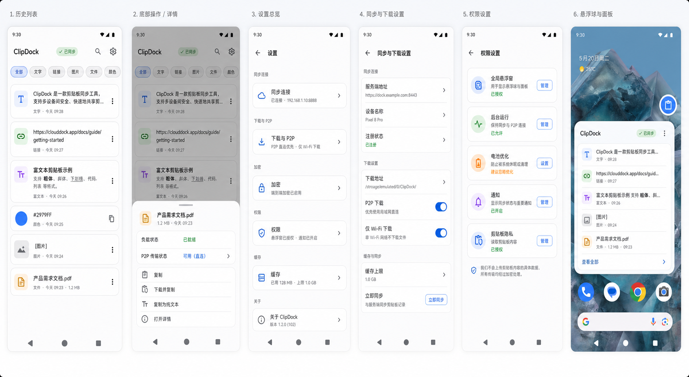

# ClipDock Android UI Design Draft v1

Date: 2026-06-01
Author: Codex
Status: Pending review

## Design Draft

Design image path:

`Android/docs/clipdock-android-ui-draft-v1.png`

## Scope Covered

This draft covers all known Android UI areas from the current product brief:

- Main app history list.
- Clipboard item action/detail sheet.
- Settings overview.
- Sync and download configuration.
- Permission settings.
- Global floating ball and compact recent-history panel.

## Screen Coverage

### 1. History

Purpose: primary launch screen showing recently synced clipboard history.

Covered item types:

- Text.
- Link.
- Rich text.
- Color.
- Image.
- File.

Rules reflected:

- Image/file rows are preview-first and lazy-payload by design.
- Image compact label uses `[图片]` where appropriate.
- File rows prioritize filename and truncate long names.
- Top area exposes sync status, search, settings, and type filters.

### 2. Item Actions

Purpose: focused operation surface for a selected record.

Covered actions:

- Copy.
- Download and copy.
- Copy as plain text.
- Open details.

State shown:

- Payload readiness.
- P2P transfer state.
- File metadata.

### 3. Settings Overview

Purpose: one place to enter all configuration groups without a marketing/onboarding layer.

Groups:

- Sync connection.
- Download and P2P.
- Encryption.
- Permissions.
- Cache.

### 4. Sync And Download

Purpose: operational setup for server sync and lazy downloads.

Rows:

- Server address.
- Device name.
- Registration status.
- Download address.
- P2P download.
- Wi-Fi-only download.
- Cache limit.
- Sync now.

### 5. Permissions

Purpose: status-first system permission checklist.

Rows:

- Global overlay.
- Background running.
- Battery optimization.
- Notifications.
- Clipboard privacy.

### 6. Floating Ball

Purpose: always-available quick access.

Behavior represented:

- Edge-snapped circular floating ball.
- Compact popup near the ball.
- Latest 5 records.
- No image thumbnails in compact mode.
- File names truncated.
- Transfer state can be shown inline.

## Unified Style Rules

- Material 3-inspired structure.
- Light theme with neutral utility surfaces.
- Type accent colors are used sparingly for scanning.
- Item card radius stays compact and restrained.
- No marketing hero, no decorative blobs, no nested card composition.
- Controls use familiar Android patterns: chips, switches, status rows, action buttons, bottom sheet.

## Review Questions

- Is the information density right for Android phones, or should rows be more compact?
- Should the floating compact panel show 5 records by default, or fewer for one-handed use?
- Should settings stay as grouped rows in one screen for v1, or split into separate pages immediately?
- Should image/file rows show a thumbnail placeholder block, or always text-only until a preview asset is available?
- Do we want a dark-theme draft before implementation approval?

## Implementation Gate

No Android app code should be created until this design draft is reviewed and explicitly approved.
