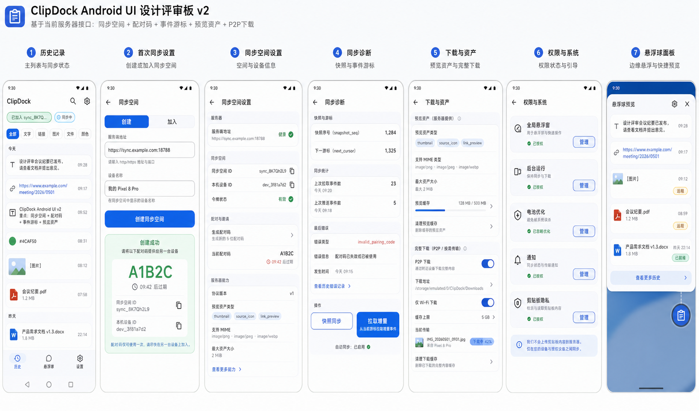

# ClipDock Android UI Design Draft v2

Date: 2026-06-01
Author: Codex
Status: Pending review

## Design Goal

Revise the Android UI around the current server interface. The main change from v1 is the settings flow: server setup now uses sync spaces and pairing codes, not setup-token registration.

## Design Draft

Design image path:

`Android/docs/clipdock-android-ui-draft-v2.png`

## Server Contract Reflected

- Create sync space: `POST /v2/sync/create`.
- Join sync space: `POST /v2/sync/join`.
- Generate invite: `POST /v2/sync/invites`.
- Capabilities: `GET /v2/info`.
- Snapshot/event sync: `GET /v2/snapshot`, `GET /v2/events`, `POST /v2/events`.
- Preview assets: `PUT/GET /v2/assets/{digest}`.

## Required UI Changes

- Replace `设置令牌` with `创建同步空间` and `加入同步空间`.
- Pairing code is a 5-character uppercase invitation with expiration countdown.
- Show current `sync_id`, local `device_id`, and token state after setup.
- Settings must separate server preview assets from P2P full payload download.
- Add sync diagnostics: snapshot state, event cursor, last error.
- Show server capabilities from `/v2/info`: protocol version, asset kinds, MIME types, max asset size.

## Revised Screen Set

### 1. History

Same core list as v1, but the top status chip should show sync-space state:

- `未加入同步空间`
- `已加入 sync_...`
- `同步中`
- `令牌失效`

### 2. First-Run Sync Setup

Primary setup screen with two modes:

- `创建新同步空间`: server address, device name, create button, returned pairing code.
- `加入已有同步空间`: server address, 5-character pairing code, device name, join button.

### 3. Sync Space Settings

Rows:

- Server address and health status.
- Sync ID.
- Device ID.
- Token state.
- Generate pairing code.
- Pairing code expiration.
- Server capabilities.

### 4. Sync Diagnostics

Rows:

- Snapshot sequence.
- Event cursor.
- Last pulled event count.
- Last pushed event count.
- Last protocol error.
- Manual resync actions.

### 5. Download And Assets

Rows:

- Preview asset sync: thumbnail/source icon/link preview.
- Max server asset size.
- Preview cache.
- P2P full payload download.
- Download address.
- Wi-Fi-only.

### 6. Permissions

Same v1 permission rows:

- Global overlay.
- Background running.
- Battery optimization.
- Notifications.
- Clipboard privacy.

### 7. Floating Ball

Same v1 behavior:

- Edge-snapped ball.
- Compact panel with latest records.
- `[图片]` for image.
- Truncated filename for file.
- Inline transfer state if payload is remote.

## Review Questions

- Should first-run setup be a dedicated screen before History, or an inline banner that opens Settings?
- Should `sync_id` be visible by default or hidden behind an advanced/details row?
- Should pairing-code generation appear on History as a quick action after setup, or stay only in Settings?
- Do we want separate `预览资产` and `完整下载` settings groups, or a single `下载` group with two subsections?

## Implementation Gate

No Android app code should be created until this v2 design draft is reviewed and explicitly approved.
