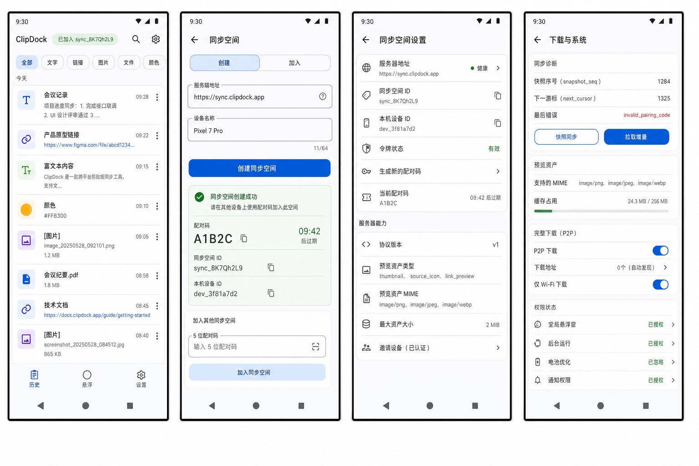
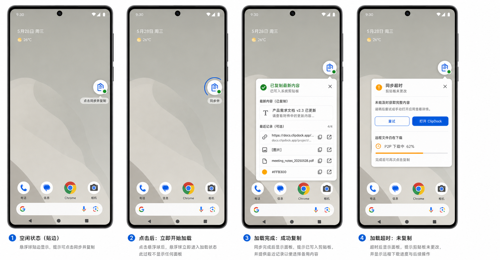

# ClipDock Android UI Design Draft v3 - Image 2

Date: 2026-06-02
Author: Codex
Status: Pending review

## Design Goal

Regenerate the Android design draft through the Image 2 image generation path after the previous draft showed visual distortion. This version reduces density by splitting the design into two sheets:

- Core app pages: history, sync setup, sync-space settings, download/system settings.
- Floating ball flow: idle edge attachment, ball-only loading after tap, completion result panel, and timeout panel.

## Design Drafts

### Core App Pages

Image path:

`Android/docs/clipdock-android-ui-draft-v3-image2.png`

### Floating Ball Flow

Image path:

`Android/docs/clipdock-android-floating-ui-draft-v3d-image2.png`

## Server Contract Reflected

- Create sync space: `POST /v1/sync/create`.
- Join sync space: `POST /v1/sync/join`.
- Generate invite: `POST /v1/sync/invites`.
- Capabilities: `GET /v1/info`.
- Snapshot/event sync: `GET /v1/snapshot`, `GET /v1/events`, `POST /v1/events`.
- Preview assets: `PUT/GET /v1/assets/{digest}`.
- Full payload download remains an on-demand P2P path and is not represented as server-hosted full-file download.

## Screen Coverage

### 1. History

- Shows synced state at the top.
- Supports type filters for all, text, link, image, file, and color.
- Represents images and files as lightweight rows without forcing full payload download.
- Keeps the list compact enough for repeated clipboard review.

### 2. First-Run Sync Setup

- Uses create/join sync-space flow instead of setup-token registration.
- Shows server address and device name before creating or joining.
- Shows a 5-character pairing code and expiry after creating a sync space.

### 3. Sync Space Settings

- Shows server health.
- Shows `sync_id`, local `device_id`, token state, invite generation, pairing code expiry, and server capabilities.
- Separates protocol/capability details from user-facing history.

### 4. Download And System

- Shows sync diagnostics with snapshot sequence, event cursor, and last error.
- Shows server preview asset support and cache usage.
- Separates P2P full download settings from preview asset sync.
- Keeps permission state rows for overlay, background run, battery optimization, and notifications.

### 5. Floating Ball

- Idle floating ball snaps to a screen edge.
- Dragging state shows edge-switching affordance.
- Tap immediately triggers one sync pass.
- After tap, only the floating ball shows loading; no compact panel is shown during loading.
- After sync, the latest usable item is written into the Android system clipboard.
- The compact window appears only after loading completes or the timeout is reached.
- On success, the panel confirms that the latest content was written to the clipboard and provides recent fallback rows.
- On timeout, the panel states that the clipboard was not changed and provides retry/open-main-app actions.
- Compact window uses placeholders and names only:
  - image rows display `[图片]`;
  - file rows display the file name;
  - long text and URLs ellipsize.
- If the latest item is a remote image/file, P2P retrieval happens inside the loading window; clipboard write happens only after the payload is local.
- If sync or P2P retrieval fails or times out, the current clipboard is left unchanged and retry/fallback actions are shown.
- Floating-ball settings include enable switch, edge snap behavior, item count, opacity, size, and required permission state.

## Prompt Summary

Generation used the built-in Image 2 image-generation path. The prompt asked for flat, front-facing Android Material 3 mockups with no perspective tilt, no warped screens, no 3D deformation, and no stretched text. The latest floating-ball prompt was revised so single tap means `sync once and copy latest`; the ball itself shows loading, and the compact panel appears only after success, failure, or timeout.

## Review Questions

- Is splitting the design into core pages plus floating-ball flow acceptable for review?
- Should the history list show preview thumbnails for image rows, or use a placeholder until the user opens the item?
- Should P2P download settings live under `下载与系统`, or under a dedicated `传输` page?
- If tap-sync fails, should the app leave the clipboard unchanged by default, or copy the latest cached item with a stale warning?

## Implementation Status

Implementation started on 2026-06-02 using Android CLI, Kotlin, and Jetpack Compose. This v3 Image 2 design remains the current reference for the initial Android implementation.
