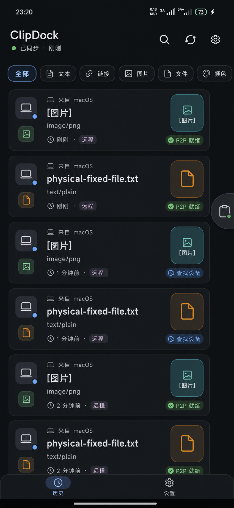

# ClipDock Android History Redesign v4 - Image 2 Review

Date: 2026-06-02
Author: Codex
Status: Pending user review

## Trigger

The current Android history page was reviewed on a real phone running `com.apkdv.clipdock/.MainActivity`.
The captured screen is stored outside the docs tree to avoid mixing runtime screenshots with design assets:

`/.codex/artifacts/android-ui/current-history-real-phone.png`

Observed device viewport:

- Screenshot size: 1200 x 2608.
- Focused activity: `com.apkdv.clipdock/com.apkdv.clipdock.MainActivity`.

## Design Draft

Image path:

`Android/docs/clipdock-android-history-redesign-v4-image2.png`

Generated through the built-in Image 2 image-generation path as a static design artifact. This is not an implementation change.

## Current UI Findings

- The app title takes too much first-viewport space for a utility history screen.
- Filter chips are oversized and one chip is clipped at the right edge on the real device.
- History rows repeat the same large placeholder glyphs, making image/file records harder to scan.
- File and image records do not expose transfer readiness clearly enough.
- The floating ball overlaps list content and can cover file names or row metadata.
- Bottom navigation visually competes with the list and needs stronger content padding.

## v4 Design Intent

- Treat the history screen as a synchronized record stream, not a stack of generic cards.
- Make sync state visible at the top with `已同步 · 刚刚`.
- Keep all type filters visible and compact.
- Show record provenance with source device text such as `来自 macOS`.
- Show payload state inline: `远程`, `P2P 就绪`, `查找设备`.
- Use lightweight image/file placeholders in the list; do not render full payload previews.
- Keep the floating ball snapped to the right edge and outside the row text area.
- Preserve two-tab navigation: `历史` and `设置`.

## Review Result

Recommendation: use v4 as the visual direction for the next implementation pass, with implementation constraints below.

Score: 86 / 100.

What works:

- The hierarchy is much clearer: source, item type, primary content, MIME/metadata, and transfer state are visually separable.
- The row treatment better matches a data-sync client: each item reads as a synced record with remote/local readiness.
- Type accents are restrained and functional instead of decorative.
- The floating ball is no longer centered over file names.
- The filter row is compact and suitable for the first viewport.

Required adjustments before implementation:

- Use a flatter background than the generated image. The real Compose UI should avoid smoky texture or glossy background noise.
- Add list bottom padding equal to bottom navigation height plus safe-area inset so the last row is never hidden.
- Keep the floating ball in a true overlay layer snapped to the screen edge. It may overlap empty right-edge space, but must not obscure item text or action chips.
- Simplify the leading column in implementation: one source icon with a small type/status badge is enough; avoid duplicating large source and type icons.
- Keep row height responsive. Image/file rows may be taller, but text/link/color rows should be denser.
- Generated text is a visual reference only. Compose implementation must use exact localized strings from resources.

## Implementation Mapping After Approval

Do not implement until this design is approved.

If approved, update these areas:

- `MainScreen.kt`: top app bar density, filter row, `HistoryRow`, bottom navigation padding, state chips.
- `FloatingOverlayService.kt` and overlay content: edge-safe placement and non-obscuring resting state.
- `ClipModels.kt` / repository state mapping if additional display fields are needed for payload transfer state labels.
- Android resources: localized labels and type/status colors.

## Open Review Questions

- Should the right-side payload tile remain visible for every image/file row, or only when preview metadata exists?
- Should `P2P 就绪` be shown as a green success chip, or should it be quieter until the user taps the item?
- Should text/link/color rows use the same two-column layout, or switch to a denser single-column row?
- Should the floating ball reserve an invisible touch gutter in the app layout while the app itself is open?
