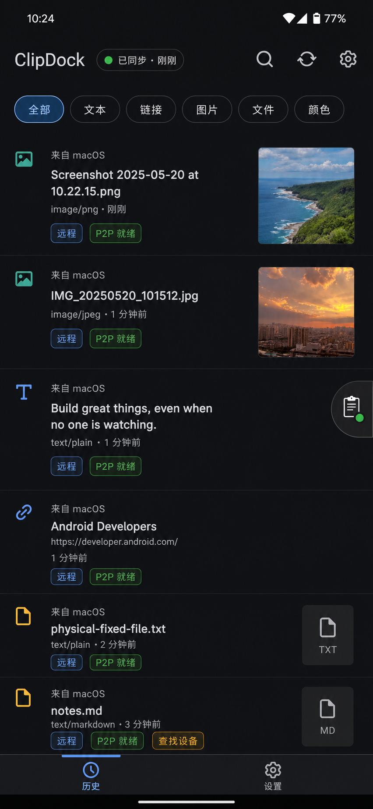

# ClipDock Android History Redesign v5 - Image Thumbnails Review

Date: 2026-06-02
Author: Codex
Status: Pending user review

## Trigger

User feedback on v4: image records should show their visual content instead of a Chinese placeholder.

This v5 draft revises the history list around actual image thumbnails while preserving the product constraint that the list uses lightweight previews and does not download/open the original payload until the user acts.

## Design Draft

Image path:

`Android/docs/clipdock-android-history-redesign-v5-image2.png`

Generated through the built-in Image 2 image-generation path as a static design artifact. This is not an implementation change.

## Updated Image Rule

- Main history image rows should show actual thumbnail content whenever a preview thumbnail is available.
- The thumbnail is a synced/derived preview, not the original full image payload.
- If a thumbnail is missing, the row may show an image icon, loading tile, or skeleton state, but should not show `[图片]` as the primary visual placeholder.
- Remote and P2P state still remain visible through chips such as `远程`, `P2P 就绪`, and `查找设备`.
- Remote image/file rows need an explicit row action such as `下载`, `取回`, or `下载并复制`; the state chip alone is not enough.
- Tap behavior remains unchanged: retrieve the original payload on demand, then copy/share after the payload is local.

## Review Result

Recommendation: v5 should replace v4 as the history-list visual direction.

Score: 91 / 100.

What improved over v4:

- Image records now communicate actual content at a glance.
- The history list feels closer to a real sync client because image previews are visually inspectable.
- Text, link, file, and image rows share the same record-stream structure without forcing all rows to the same height.
- Transfer state remains clear without dominating the row.

Implementation constraints:

- Use the existing preview asset pipeline where possible; do not download full image payloads just to populate the list.
- Reserve stable thumbnail dimensions so image loading does not shift row layout.
- Add a placeholder only as a temporary loading/error state, and prefer an icon/skeleton over text.
- Keep thumbnails clipped to small rounded rectangles; no full-width image cards in the history list.
- Preserve privacy options later if encrypted/sensitive payloads should hide thumbnails.
- Do not ship a remote image/file row with only a status label. It must include a visible action target for retrieval.

## Scope Boundary

This change applies to the main app history list.

The floating-ball compact result panel previously had a stricter text-only contract for compactness and privacy. It can remain text-only unless the product decision changes separately.
