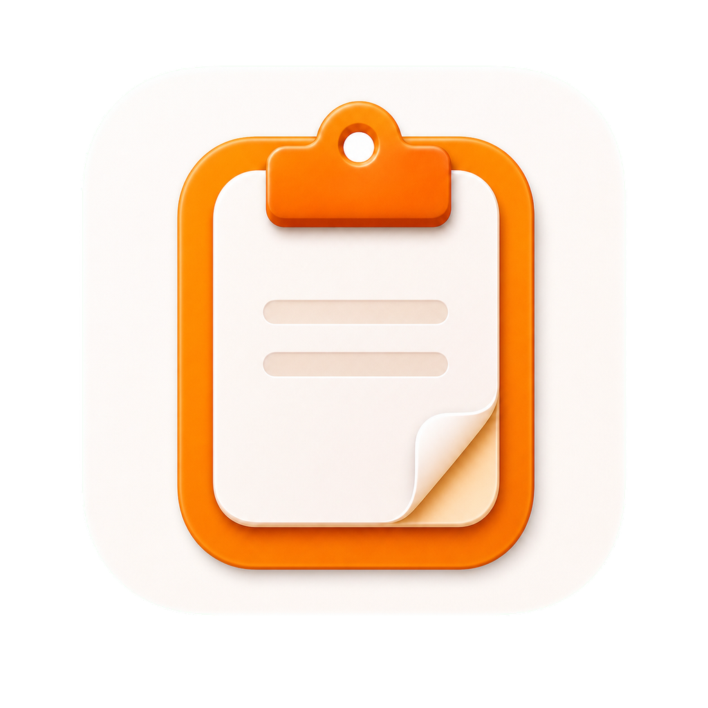

# ClipDock

<p align="center">
  
</p>

<p align="center">
  <strong>把复制过的内容留在手边，找回、预览、固定、同步、复用。</strong>
</p>

<p align="center">
  
  
  
  
  
</p>

<p align="center">
  <a href="README.en.md">English</a> ·
  <a href="https://clip.run.ci/">产品官网</a>
</p>


> 本 README 中的 ClipDock 截图来自真实运行的 macOS 应用窗口，使用干净桌面背景与样例剪贴板数据截取。

## 它是什么

ClipDock 是一款本地优先的 macOS 剪贴板工具。复制过的文本、链接、颜色、图片和文件，会以一排轻量卡片留在屏幕底部；需要时按快捷键呼出，确认一下就能继续用。

它不是一个需要长期停留的管理后台，而是贴近日常工作的一层剪贴坞：呼出、扫读、预览、取用，然后收起。

新版本开始支持跨设备使用。你可以运行自己的同步服务端，用 5 位配对码把其他设备加入同一个同步空间；文字和记录走同步服务，图片、文件这类大内容再通过 P2P 按需下载。服务端只负责认证、事件和 P2P 协调，不托管你的完整大文件。

## 为什么需要它

日常办公、开发、设计和资料整理里，真正耗时的往往不是复制，而是几分钟后重新找那段文字、那个链接、那张图或那个文件。macOS 默认只保留最后一次复制；ClipDock 把最近用过的内容留在可浏览、可预览、可复用的位置。

## 它可以做什么

- **不打断当前工作**<br>
  按下 `Command + Shift + X`，剪贴坞从屏幕底部出现，不需要切到另一个窗口。

- **全键盘操作**<br>
  方向键移动选择，`Command + F` 搜索，`Space` 预览，`Command + C` 复制，`Command + 1` 到 `Command + 9` 快速取用可见内容，`Delete` 删除，`Esc` 收起或返回。

- **快速找回刚复制过的内容**<br>
  最近复制过的内容以横向卡片呈现；列表长了，直接搜索定位。

- **按类型识别内容**<br>
  文本、富文本、链接、颜色、图片和文件都有自己的卡片样式，不用点开也能大致判断内容。

- **复用前先确认**<br>
  重新粘贴之前，先看完整文本、图片预览、文件预览或链接信息，减少误选。

- **固定常用资料**<br>
  常用话术、资料链接、设计参考、发布内容可以固定到 Pinboard，不会被临时复制记录淹没。

- **本地优先，可选同步**<br>
  剪贴板历史默认留在本机。需要多设备时，再接入你自己的 ClipDock Sync Server，把记录同步到同一个空间。

- **配对码加入设备**<br>
  在 macOS 创建同步空间后，其他 Mac 或 Android 设备可以用一次性 5 位配对码加入；加入后使用设备凭证访问，不需要公共账号系统。

- **P2P 按需传输大内容**<br>
  完整图片、文件等大内容可以通过 `iroh-blobs` 从可用设备下载；服务端只登记谁能提供内容和怎样连接，不中转大文件本身。

## 更自然的剪贴板

剪贴板历史不应该变成另一套“待整理系统”。ClipDock 更适合那些高频跨应用的日常场景：写文档、做研发、整理资料、对接客户、准备发布内容、沉淀团队素材。

它关注的不是无限归档，而是把刚刚复制过、马上可能还要用的内容变得更容易找、更容易确认、更容易复用。

## 预览与固定

主面板把搜索、Pinboard 快捷入口和内容卡片放在同一条横向工作区里。你可以直接扫最近内容，而不是进入一个完整的管理后台；核心流程也可以全程键盘完成。

预览不是附加功能，而是核心交互。文本保持可读，图片显示真实内容，文件提供文档预览，颜色直接呈现色块，链接可以显示标题、描述和封面图。截图中的 GitHub 卡片来自 `https://github.com/` 的 Open Graph 预览。


Pinboard 适合放那些“不是临时复制，但也不值得专门建库”的内容：产品资料、设计参考、发布说明、客户资料归档、团队知识库。它们留在手边，而不是反复从聊天记录、浏览器或文件夹里翻。

设置页只服务主流程，不抢占主流程。通用行为、隐私规则、键盘快捷键和关于信息都在独立页面里，日常使用仍然围绕剪贴坞、预览和 Pinboard 展开。

## 同步与 P2P

ClipDock 的同步设计坚持三件事：自托管、按空间隔离、本地优先。

- **自托管 Sync Server**：`Server/` 提供 Rust/Axum 同步服务，负责创建同步空间、配对设备、保存事件日志、返回快照，并存储小型预览资产。
- **一次性配对码**：通过 `POST /v2/sync/create` 创建同步空间，再用短期 5 位配对码让新设备加入；设备 token 只以哈希形式保存在服务端。
- **事件与快照同步**：剪贴板条目通过 `item_upsert` / `item_delete` 事件同步，支持 cursor 拉取、幂等重放和 tombstone 删除传播。
- **P2P 协调**：设备向服务端报告 P2P endpoint 和 asset provider，其他设备只会在同一同步空间里看到这些来源。
- **大内容按需走 P2P**：图片、文件等完整内容由设备通过 `iroh-blobs` 下载；服务端不运行 Iroh，也不负责 NAT 穿透或大文件字节中转。
- **Android 端**：`Android/` 已包含加入同步空间、拉取快照/事件、P2P 下载图片与文件、悬浮球取用等能力。

## 隐私

ClipDock 默认只在本地工作。只有你明确启用同步并配置服务端地址后，它才会把同步事件发送到对应服务端。

同步服务端按同步空间隔离数据。知道服务端 URL 并不能读取已有内容；设备必须先创建同步空间，或通过有效配对码加入。P2P endpoint 和 provider 记录也只在同一同步空间内可见。

## 安装

访问产品官网获取当前介绍与发布信息：[https://clip.run.ci/](https://clip.run.ci/)。

下载最新版本，将 ClipDock 拖入“应用程序”，然后按 `Command + Shift + X` 呼出剪贴坞。

如果首次打开时 macOS 提示 Apple 无法验证 ClipDock，请参考普通用户指南：[首次打开帮助](https://clip.run.ci/open-clipdock.html)。

> 公开安装包会随首个 GitHub Release 一起发布。

## 开源

ClipDock 选择开源，是因为剪贴板工具足够贴近日常工作和个人数据。用户应该能够看到它如何工作、在本地运行它、提出改进，并一起把它打磨成更可靠的日常工具。

## 开发者说明

### 项目结构

- `macOS/`：主 macOS 应用，Swift UI 与 AppKit 运行时在 `macOS/Sources/ClipDock`，可复用面板逻辑在 `macOS/Sources/ClipboardPanelApp`，Rust FFI core 在 `macOS/rust`。
- `Server/`：自托管同步服务端，协议文档在 `Server/docs/protocol-v2.md`。
- `Android/`：Android 端，包含同步空间配置、快照/事件拉取、P2P 下载和悬浮球入口。
- `docs/`：GitHub Pages 官网目录，包含产品首页、安装帮助页、站点 manifest、CNAME 和页面资产。

### 环境要求

- macOS 13.0 或更高版本
- Xcode 命令行工具
- Swift 6.1 工具链
- Rust stable 工具链
- Android Studio / Android SDK（开发 Android 端时）

### 从源码运行 macOS 应用

```bash
cd macOS
scripts/build-rust-core.sh
swift run ClipDock
```

源码 executable 和发布产品都命名为 `ClipDock`。

### 运行自托管同步服务端

```bash
cd Server
cargo run -- --bind 127.0.0.1:8787
```

服务端部署边界和 API 细节见 [Server/README.md](Server/README.md) 与 [Server/docs/protocol-v2.md](Server/docs/protocol-v2.md)。

### 常用验证

```bash
cd macOS && swift test
cd macOS && cargo test --manifest-path rust/Cargo.toml
cd Server && cargo fmt --check && cargo test && cargo clippy --all-targets -- -D warnings
```

### 文档记录

Updated on 2026-06-02 by Codex.
