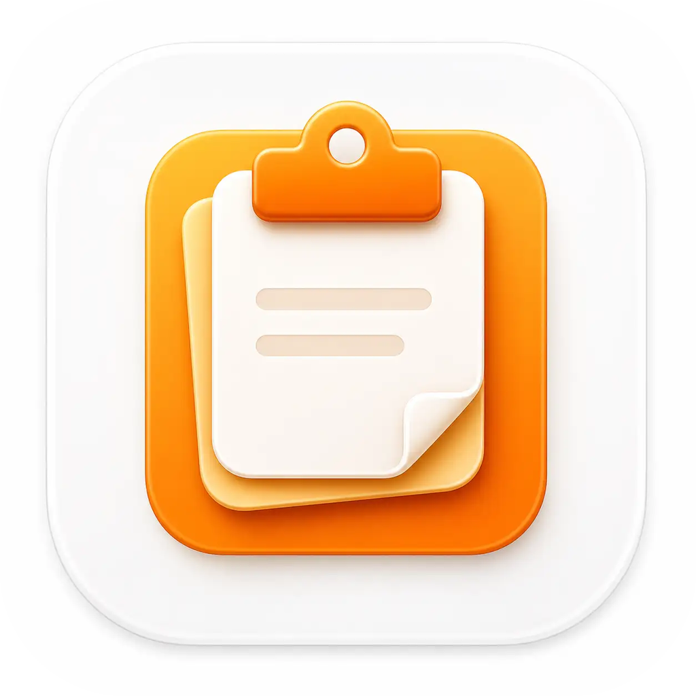
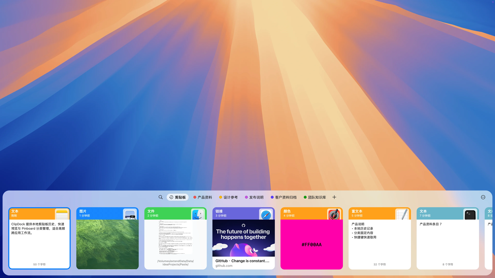
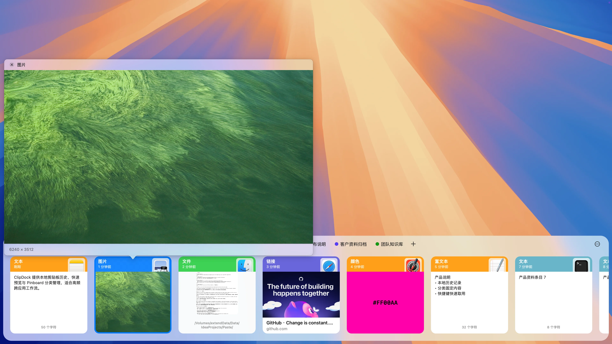
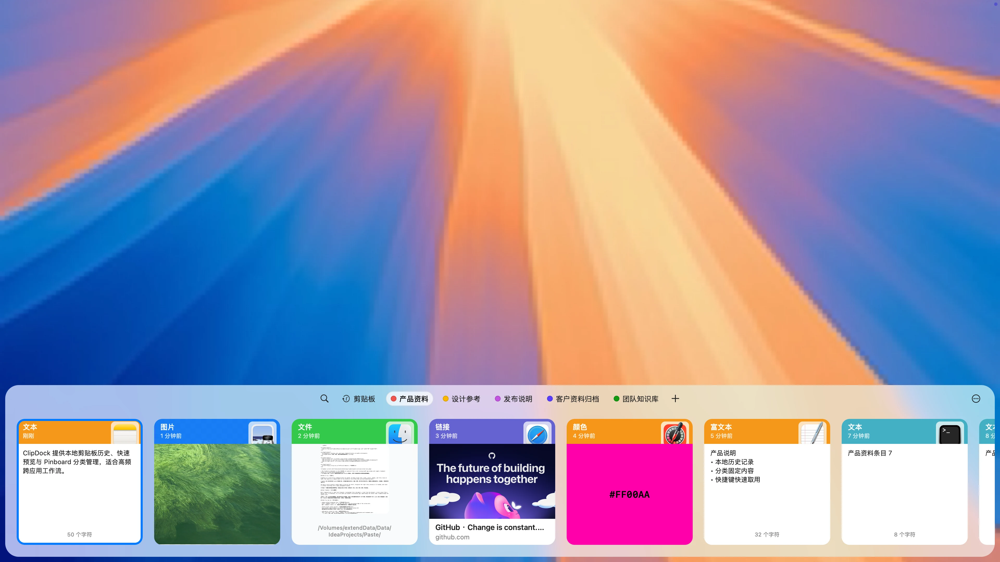

# ClipDock

<p align="center">
  
</p>

<p align="center">
  <strong>Recall, preview, pin, and reuse clipboard history on macOS.</strong><br>
  <strong>在 macOS 上找回、预览、固定并复用剪贴板内容。</strong>
</p>

<p align="center">
  
  
  
</p>

<p align="center">
  <a href="https://clip.run.ci/">Official Website / 产品官网</a>
</p>



> The ClipDock screenshots in this README are captured from a real running macOS app window with sample clipboard content on a clean desktop background.<br>
> 本 README 中的 ClipDock 截图来自真实运行的 macOS 应用窗口，使用干净桌面背景与样例剪贴板数据截取。

## What It Is / 它是什么

ClipDock is a local-first clipboard shelf for macOS. It keeps recent text, links, colors, images, and files close at hand, then opens as a compact panel at the bottom of the screen when you need something back.

ClipDock 是一款本地优先的 macOS 剪贴板工具。它把最近复制过的文本、链接、颜色、图片和文件放在手边，需要时从屏幕底部呼出，快速确认，再继续回到当前工作。

The app is built around a simple habit: bring up the shelf, recognize the right item, preview it if needed, and reuse it without switching into a heavy management window.

它不是另一个需要长期停留的管理界面，而是贴近日常工作流的一层剪贴坞：呼出、扫读、预览、取用，然后收起。

## Why ClipDock / 为什么需要它

Most clipboard work is small but frequent: a paragraph from a document, a link from the browser, a color value from a design file, a screenshot, or a file path you copied a few minutes ago. macOS keeps the latest item. ClipDock keeps the useful trail.

日常办公、开发、设计和资料整理里，真正耗时的往往不是复制，而是几分钟后重新找那段文字、那个链接、那张图或那个文件。macOS 默认只保留最后一次复制；ClipDock 把最近用过的内容留在可浏览、可预览、可复用的位置。

## What You Can Do / 你可以做什么

- **Open without breaking flow / 不打断当前工作**<br>
  Press `Command + Shift + X` to open the shelf from the bottom edge of the screen.<br>
  按下 `Command + Shift + X`，剪贴坞从屏幕底部出现，不需要离开当前应用。

- **Find recent copies quickly / 快速找回刚复制过的内容**<br>
  Scan recent clips visually, or search when the history grows.<br>
  最近复制过的内容以横向卡片呈现；内容多了以后，也可以直接搜索定位。

- **Recognize content by type / 按类型识别内容**<br>
  Text, rich text, links, colors, images, and files each get a dedicated card treatment.<br>
  文本、富文本、链接、颜色、图片和文件都有对应样式，不必点开才知道复制的是什么。

- **Preview before reuse / 复用前先确认**<br>
  Open a focused preview for text, links, colors, images, and files before reusing them.<br>
  重新粘贴之前，可以先看完整内容、图片预览、文件预览或链接信息，减少误选。

- **Pin reusable material / 固定常用资料**<br>
  Save important clips into Pinboards so they do not get buried in short-lived clipboard history.<br>
  常用话术、资料链接、设计参考、发布内容可以固定到 Pinboard，不会被临时复制记录淹没。

- **Keep clipboard data local / 数据留在本地**<br>
  ClipDock keeps clipboard history on your Mac in the current version.<br>
  当前版本的剪贴板历史保存在本地，不需要账号，也不会把日常复制内容上传到云端。

## A More Natural Clipboard / 更自然的剪贴板

Clipboard history should feel like part of the desktop, not a separate place you have to manage. ClipDock stays low, visual, and quick enough for daily use across writing, development, research, design, communication, and documentation.

剪贴板历史不应该变成另一个“待整理系统”。ClipDock 更适合国内常见的高频跨应用场景：写文档、做研发、整理资料、对接客户、准备发布内容、沉淀团队素材。

The goal is not to archive everything forever. It is to make the things you just copied easy to find, easy to confirm, and easy to reuse.

它关注的不是无限归档，而是把刚刚复制过、马上可能还要用的内容变得更容易找、更容易确认、更容易复用。

## Preview And Pinboards / 预览与固定

The shelf combines search, Pinboard shortcuts, and typed content cards in one horizontal workspace. You can move through recent clips without opening a full library view.

主面板把搜索、Pinboard 快捷入口和类型化内容卡片放在同一条横向工作区里。你可以直接扫最近内容，而不是进入一个完整的管理后台。

Preview is part of the core interaction. Text stays readable, images show the real image, files expose a document preview, colors render as swatches, and links can show page metadata. The GitHub card in the screenshot is backed by a ready Open Graph preview for `https://github.com/`.

预览不是附加功能，而是核心交互。文本保持可读，图片显示真实内容，文件提供文档预览，颜色直接呈现色块，链接可以显示页面元数据。截图中的 GitHub 卡片使用的是 `https://github.com/` 的 ready 状态 Open Graph 预览。





Pinboards separate durable material from short-lived history. Product notes, design references, release text, customer documents, and team knowledge can stay one click away.

Pinboard 用来承载那些“不是临时复制，但也不值得专门建库”的内容：产品资料、设计参考、发布说明、客户资料归档、团队知识库。它们可以留在手边，而不是反复从聊天记录、浏览器或文件夹里翻。

Settings support the workflow without becoming the product surface. General behavior, privacy rules, keyboard shortcuts, and about information are kept in focused pages behind the main shelf.

设置页服务于主流程，而不是抢占主流程。通用行为、隐私规则、键盘快捷键和关于信息都在独立页面里，日常使用仍然围绕剪贴坞、预览和 Pinboard 展开。

## Privacy / 隐私

In the current version, clipboard history is stored locally on your Mac. ClipDock does not require an account, and normal clipboard use does not upload your copied content.

当前版本中，剪贴板历史保存在你的 Mac 本地。ClipDock 不需要账号，日常复制内容也不会在正常使用流程中上传到服务器。

## Install / 安装

Visit the official website for the current product introduction and release information: [https://clip.run.ci/](https://clip.run.ci/).

访问产品官网获取当前介绍与发布信息：[https://clip.run.ci/](https://clip.run.ci/)。

Download the latest release, drag ClipDock into Applications, then press `Command + Shift + X` to open the shelf.

下载最新版本，将 ClipDock 拖入“应用程序”，然后按 `Command + Shift + X` 呼出剪贴坞。

If macOS says Apple cannot verify ClipDock the first time you open it, follow the ordinary-user guide: [First-open help](https://clip.run.ci/open-clipdock.html).

如果首次打开时 macOS 提示 Apple 无法验证 ClipDock，请参考普通用户指南：[首次打开帮助](https://clip.run.ci/open-clipdock.html)。

> Public release packages will be published with the first GitHub release.<br>
> 公开安装包会随首个 GitHub Release 一起发布。

## Open Source / 开源

ClipDock is open source because clipboard tools are personal infrastructure. You should be able to inspect how it works, run it locally, and help shape a tool that sits close to everyday work.

ClipDock 选择开源，是因为剪贴板工具足够贴近日常工作和个人数据。用户应该能够看到它如何工作、在本地运行它、提出改进，并一起把它打磨成更可靠的日常工具。

## Developer Notes / 开发者说明

### Requirements / 环境要求

- macOS 13.0 or later / macOS 13.0 或更高版本
- Xcode command line tools / Xcode 命令行工具
- Swift 6.1 toolchain / Swift 6.1 工具链
- Rust stable toolchain / Rust stable 工具链

### Run From Source / 从源码运行

```bash
scripts/build-rust-core.sh
swift run ClipDock
```

The source executable and release product are both named `ClipDock`.

### Documentation Record / 文档记录

Updated on 2026-05-18 by Codex.
