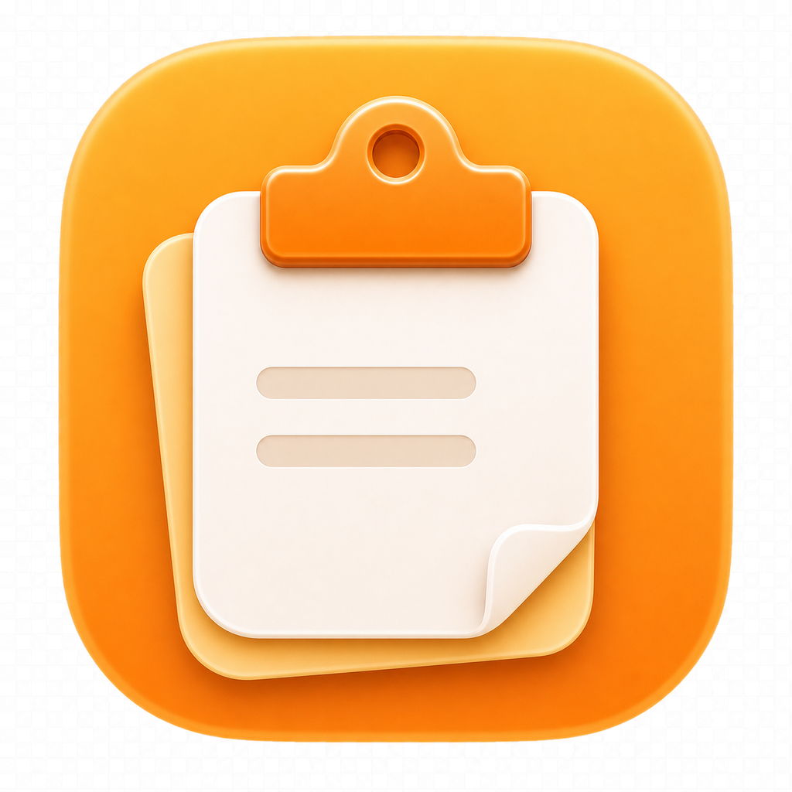
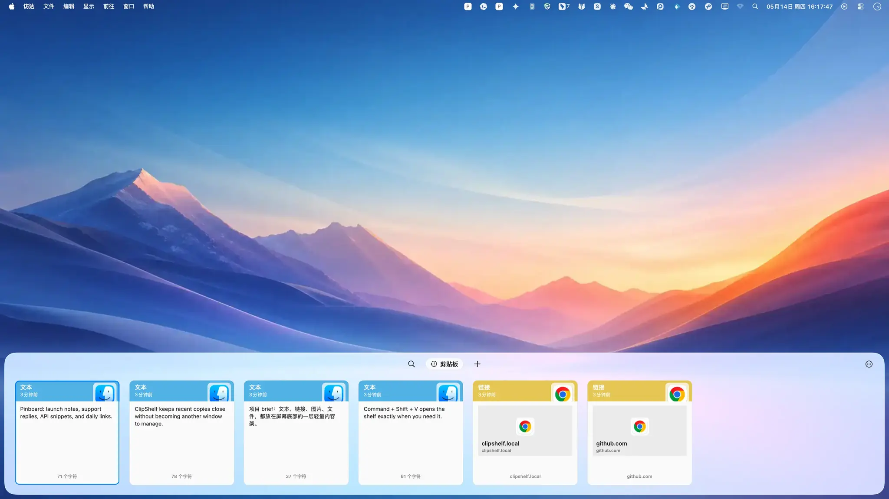
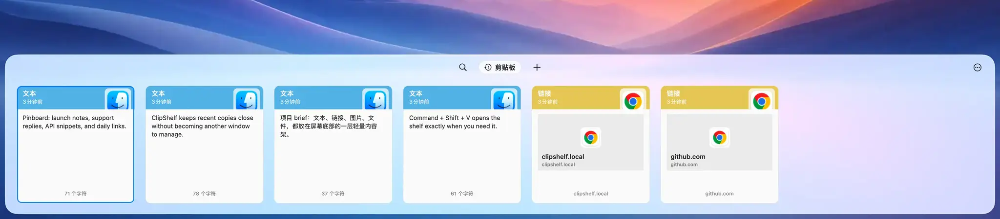

# ClipShelf

<p align="center">
  
</p>

<p align="center">
  <strong>A lightweight shelf for everything you copy on macOS.</strong><br>
  <strong>一个贴在 macOS 底部、随时呼出的轻量剪贴板内容架。</strong>
</p>

<p align="center">
  
  
  
</p>



> The ClipShelf panel shown here is rendered by the real app with sample clipboard content. The wallpaper backdrop may be AI-generated.<br>
> 图中的 ClipShelf 面板来自真实应用运行画面，内容为样例剪贴板数据；壁纸背景可能由 AI 生成。

## What It Is / 它是什么

ClipShelf is a clipboard shelf for macOS. It quietly keeps the things you copied, then appears from the bottom of the screen when you need to find one again.

ClipShelf 是一个 macOS 剪贴板内容架。它会安静记录你复制过的内容，并在需要时从屏幕底部轻轻展开，帮你快速找回刚刚用过的文本、链接、图片或文件。

It is not a heavy clipboard manager, not a dashboard, and not another window you have to manage. It feels more like a shelf attached to your desktop: quick to open, easy to scan, and gone when the job is done.

它不是一个厚重的“管理后台”，也不是又一个需要管理的大窗口。它更像贴在桌面底部的一层轻量架子：呼出很快、扫读很快，用完就收起。

## Why ClipShelf / 为什么需要它

We copy things all day: a sentence from a chat, a link from the browser, a screenshot, a file, a small snippet we need again five minutes later. macOS only keeps the latest one. ClipShelf keeps the recent ones within reach.

我们每天都在复制：聊天里的一句话、浏览器里的链接、一张截图、一个文件、几分钟后还要再用的小片段。macOS 默认只记住最后一次复制。ClipShelf 把最近复制过的东西都放在手边。



## What You Can Do / 你可以做什么

- **Bring it up instantly / 随时呼出**<br>
  Press `Command + Shift + V` to open the shelf from the bottom of the screen.<br>
  按下 `Command + Shift + V`，从屏幕底部呼出内容架。

- **Find recent copies fast / 快速找回刚复制过的内容**<br>
  Browse recent items visually, or search when the list gets long.<br>
  可以直接横向扫一眼，也可以在内容变多后搜索定位。

- **Preview before using / 使用前先确认**<br>
  Check text, links, images, and files before putting them back on the clipboard.<br>
  在回贴之前先确认文本、链接、图片和文件，减少误选。

- **Keep important snippets / 固定常用内容**<br>
  Pin reusable content so it does not get lost in everyday clipboard noise.<br>
  把常用片段固定起来，不被日常临时复制内容淹没。

- **Stay focused / 不打断当前工作**<br>
  ClipShelf appears only when you call it and hides after you pick something.<br>
  ClipShelf 只在你需要时出现，选完内容后自动退回幕后。

## A More Natural Clipboard / 更自然的剪贴板

ClipShelf is designed for people who move between apps all day: writing, coding, researching, designing, chatting, collecting references, and reusing small pieces of information.

ClipShelf 适合每天在多个应用之间来回切换的人：写作、开发、资料整理、设计、聊天、收集参考、复用零散信息。

The goal is simple: make clipboard history feel like part of macOS, not a separate place you have to visit.

目标很简单：让剪贴板历史像 macOS 的一部分，而不是另一个需要专门打开和整理的地方。

## Privacy / 隐私

Your clipboard history stays on your Mac in the current version. ClipShelf does not require an account, and it does not upload your clipboard content as part of its normal workflow.

当前版本中，剪贴板历史保存在你的 Mac 上。ClipShelf 不需要账号，也不会在正常使用流程中上传你的剪贴板内容。

## Install / 安装

Download the latest release, drag ClipShelf into Applications, then press `Command + Shift + V` to open the shelf.

下载最新版本，将 ClipShelf 拖入“应用程序”，然后按 `Command + Shift + V` 呼出内容架。

> Public release packages will be published with the first GitHub release.<br>
> 公开安装包会随首个 GitHub Release 一起发布。

## Open Source / 开源

ClipShelf is open source because clipboard tools are personal. You should be able to see how the app works, run it locally, suggest improvements, and shape it into a better everyday tool.

ClipShelf 选择开源，是因为剪贴板工具足够贴近日常工作流。你应该可以看到它如何工作、本地运行它、提出改进，并一起把它打磨成更顺手的日常工具。

<details>
<summary>Developer Notes / 开发者说明</summary>

### Requirements / 环境要求

- macOS 13.0 or later / macOS 13.0 或更高版本
- Xcode command line tools / Xcode 命令行工具
- Swift 6.1 toolchain / Swift 6.1 工具链
- Rust stable toolchain / Rust stable 工具链

### Run From Source / 从源码运行

```bash
scripts/build-rust-core.sh
swift run PasteFloating
```

`PasteFloating` is the current development executable target. The user-facing product name is ClipShelf.

`PasteFloating` 是当前开发阶段的可执行 target，用户可见产品名是 ClipShelf。

### Local Release Build / 本地发布构建

```bash
scripts/package-macos-app.sh
scripts/release-macos.sh
```

Generated artifacts are written under `.codex/artifacts/`.

生成产物会写入 `.codex/artifacts/`。

### Verification / 验证

```bash
cargo test --manifest-path rust/Cargo.toml
scripts/build-rust-core.sh
swift build
swift test
```

### Repository Map / 仓库结构

- `Sources/ClipboardPanelApp`: app UI and product behavior.
- `Sources/PasteFloating`: current macOS executable shell.
- `rust/crates/clipboard_core`: local storage and clipboard history core.
- `Generated/ClipboardCoreBridge`: generated bridge package.
- `Tests/ClipboardPanelAppTests`: automated tests.
- `docs/`: architecture, release, QA, and design notes.

### Documentation / 文档

- [Architecture](docs/architecture.md)
- [Release workflow](docs/release.md)
- [UI design](docs/ui-design.md)
- [Feature QA log](docs/feature-qa-log.md)

</details>
