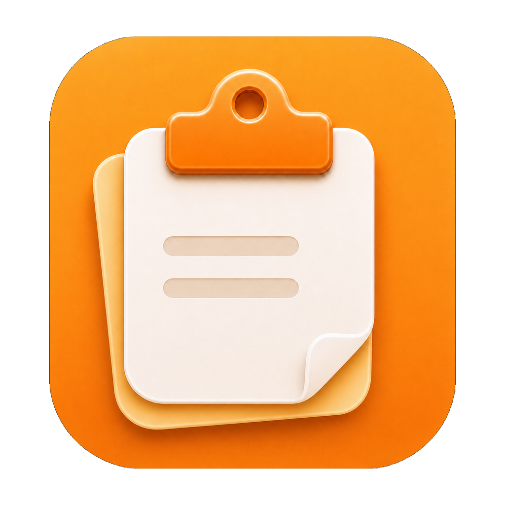
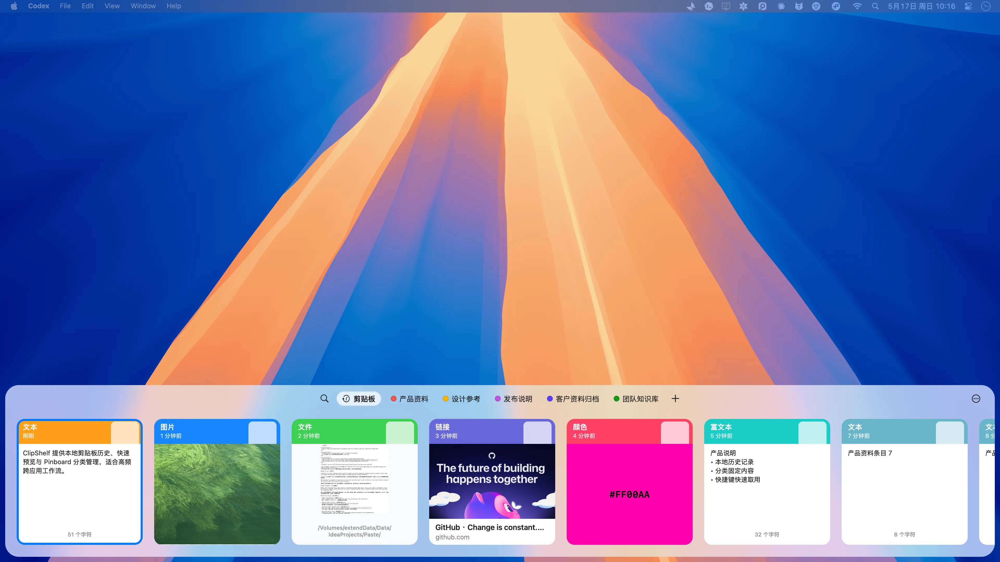
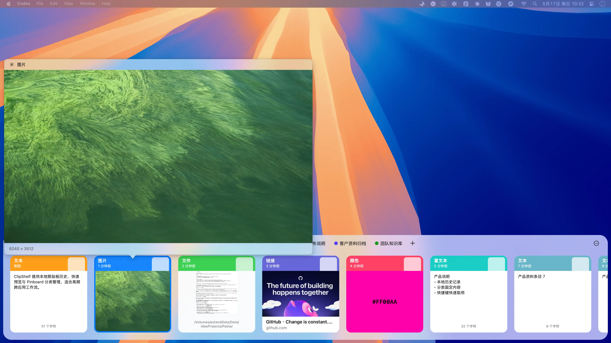
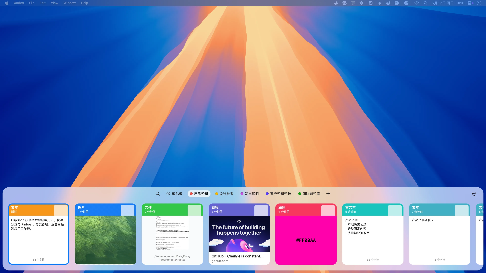

# ClipShelf

<p align="center">
  
</p>

<p align="center">
  <strong>A local clipboard history shelf for macOS.</strong><br>
  <strong>面向 macOS 的本地剪贴板历史内容架。</strong>
</p>

<p align="center">
  
  
  
</p>



> The ClipShelf screenshots in this README are captured from a real running app window on a secondary display with sample clipboard content.<br>
> 本 README 中的 ClipShelf 截图来自副屏上真实运行的应用窗口，内容为样例剪贴板数据。

## What It Is / 它是什么

ClipShelf is a local clipboard history shelf for macOS. It records supported clipboard content, presents recent items in a compact bottom panel, and helps organize reusable material through Pinboards.

ClipShelf 是一款面向 macOS 的本地剪贴板历史内容架。它记录受支持的剪贴板内容，在底部紧凑面板中展示最近条目，并通过 Pinboard 管理需要长期复用的资料。

The interface is designed to stay close to the current workflow: open it with a shortcut, scan recent content, preview the selected item, then return to the active app.

界面设计目标是尽量贴近当前工作流：通过快捷键呼出，快速浏览最近内容，预览选中条目，然后回到当前应用继续工作。

## Why ClipShelf / 为什么需要它

Modern work frequently moves small pieces of information between apps: text, links, color values, screenshots, files, and reference snippets. macOS keeps only the latest clipboard item by default; ClipShelf keeps recent items available for review and reuse.

现代工作流经常需要在多个应用之间转移小型信息单元：文本、链接、颜色值、截图、文件和参考片段。macOS 默认只保留最后一次复制内容；ClipShelf 将最近条目保留在可浏览、可预览、可复用的位置。

## What You Can Do / 你可以做什么

- **Open from anywhere / 全局呼出**<br>
  Press `Command + Shift + V` to open the shelf from the bottom of the screen.<br>
  按下 `Command + Shift + V`，从屏幕底部呼出内容架。

- **Review recent content / 浏览最近内容**<br>
  Browse recent items visually, or search when the list grows.<br>
  通过横向卡片浏览最近条目，也可以在内容增多后使用搜索定位。

- **Display typed clipboard items / 类型化展示**<br>
  Text, rich text, links, colors, images, and files use dedicated card presentations.<br>
  文本、富文本、链接、颜色、图片和文件会以对应的卡片样式展示，便于识别和确认。

- **Preview before reuse / 复用前预览**<br>
  Check text, links, colors, images, and files before putting them back on the clipboard.<br>
  在重新使用之前预览文本、链接、颜色、图片和文件，降低误选成本。

- **Organize reusable material / 管理复用资料**<br>
  Pin important content into Pinboards so it remains separate from transient clipboard activity.<br>
  将重要内容固定到 Pinboard 中，使其与临时剪贴板记录区分管理。

- **Return to work quickly / 快速回到工作流**<br>
  ClipShelf is intended to appear only when needed and stay out of the way after selection.<br>
  ClipShelf 只在需要时出现，并在完成选择后回到后台，减少对当前任务的干扰。

## A More Natural Clipboard / 更自然的剪贴板

ClipShelf is designed for users who frequently move information across writing, development, research, design, communication, and documentation workflows.

ClipShelf 适用于需要在写作、开发、研究、设计、沟通和文档整理之间频繁转移信息的用户。

The goal is to make clipboard history feel like a native extension of macOS rather than a separate management surface.

目标是让剪贴板历史更像 macOS 的自然延伸，而不是一个需要额外维护的管理界面。

## Preview And Pinboards / 预览与固定

The main shelf keeps scope controls, search, Pinboard shortcuts, and typed content cards in a single horizontal workspace. Each supported content type has a dedicated presentation so users can identify what they copied before reusing it.

主面板将范围控制、搜索、Pinboard 快捷入口和类型化内容卡片整合在同一条横向工作区中。每一种受支持的内容类型都有对应展示方式，用户可以在重新使用前确认复制内容。

Preview is a first-class part of the workflow. Text and rich text stay readable inside cards, image items show the actual captured image, file items expose a document preview, colors render as swatches, and links can show fetched metadata from the target page. The GitHub card in the screenshot is backed by a ready Open Graph preview for `https://github.com/`.

预览是核心工作流的一部分。文本和富文本会保持可读，图片条目展示真实图片，文件条目展示文档预览，颜色以色块呈现，链接可以显示来自目标页面的元数据。截图中的 GitHub 卡片使用的是 `https://github.com/` 的 ready 状态 Open Graph 预览。





Pinboards keep durable material separate from short-lived clipboard history. The shelf can switch directly into a Pinboard filter, making product notes, design references, release material, customer documents, or team knowledge available without searching through transient clipboard activity.

Pinboard 将需要长期保留的资料与临时剪贴板历史分开管理。主面板可以直接切换到指定 Pinboard，例如产品资料、设计参考、发布说明、客户资料归档或团队知识库，而不需要在临时记录中反复搜索。

Settings remain available for the supporting workflow: general behavior, privacy rules, keyboard shortcuts, and about information are split into focused pages, but they are secondary to the shelf, preview, and Pinboard experience.

设置页用于支撑主流程：通用行为、隐私规则、键盘快捷键和关于信息分别放在聚焦页面中，但它们是内容架、预览和 Pinboard 体验的辅助部分。

## Privacy / 隐私

Your clipboard history stays on your Mac in the current version. ClipShelf does not require an account, and it does not upload your clipboard content as part of its normal workflow.

当前版本中，剪贴板历史保存在你的 Mac 上。ClipShelf 不需要账号，也不会在正常使用流程中上传你的剪贴板内容。

## Install / 安装

Download the latest release, drag ClipShelf into Applications, then press `Command + Shift + V` to open the shelf.

下载最新版本，将 ClipShelf 拖入“应用程序”，然后按 `Command + Shift + V` 呼出内容架。

> Public release packages will be published with the first GitHub release.<br>
> 公开安装包会随首个 GitHub Release 一起发布。

## Open Source / 开源

ClipShelf is open source because clipboard tools are personal. You should be able to see how the app works, run it locally, suggest improvements, and shape it into a better everyday tool.

ClipShelf 选择开源，是因为剪贴板工具足够贴近日常工作流。你应该可以看到它如何工作、本地运行它、提出改进，并一起把它打磨成更顺手的日常工具。

## Developer Notes / 开发者说明

### Requirements / 环境要求

- macOS 13.0 or later / macOS 13.0 或更高版本
- Xcode command line tools / Xcode 命令行工具
- Swift 6.1 toolchain / Swift 6.1 工具链
- Rust stable toolchain / Rust stable 工具链

### Run From Source / 从源码运行

```bash
scripts/build-rust-core.sh
swift run ClipShelf
```

The source executable and release product are both named `ClipShelf`.
