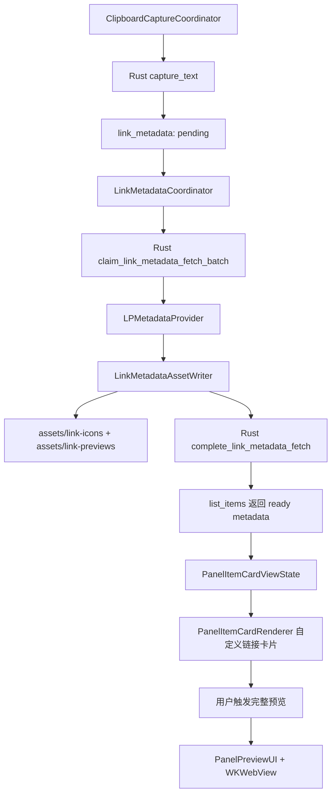
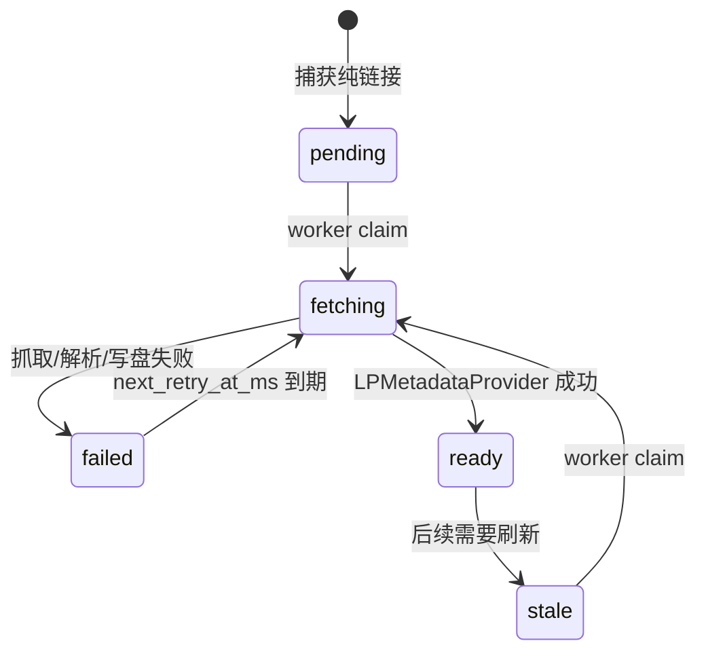

# Paste-like 链接卡片展示架构方案

日期：2026-05-15

执行者：Codex 架构师

状态：v4，已完成 metadata 默认生成语义修订、代码实现与本地验证

## 1. 设计目标

基于 Paste 逆向文档和 ClipShelf 当前代码，设计一套 Paste-like 但保持 ClipShelf 原创视觉的链接卡片展示方案。

目标：

- 面板链接卡片具备标题、规范化 URL、站点图标、网页摘要图四类展示能力。
- 面板滚动时不联网、不创建 `WKWebView`、不触发 `LPMetadataProvider`。
- 链接元数据后台异步抓取，状态可追踪、可重试，默认生成卡片 metadata。
- 完整网页预览继续只在用户按空格或触发预览时使用 `WKWebView`。
- 唯一用户开关是“网页完整预览”，只控制 `WKWebView` 完整网页加载，不控制卡片 metadata。

非目标：

- 不复制 Paste 的品牌、文案、卡片尺寸、动画曲线或可识别视觉组合。
- 不在面板 cell 内嵌入 `LPLinkView` 或 `WKWebView`。
- 不把大图二进制直接塞进 SQLite。
- 不引入自研 HTML 解析器作为第一实现，优先使用系统 `LinkPresentation`。
- 当前项目仍在开发阶段，本方案不承担旧 metadata 开关、旧 API 或旧偏好语义兼容；相关代码直接删除。v7 migration 只用于把已有开发库 schema 收敛到新状态集合，并避免修改已记录 checksum 的旧 migration。

## 1.1 评审门禁结论

本方案经过一轮 QA 与资深 macOS 开发初审后被打回，架构师已完成 v2 修订。复审结论：

- QA 复审通过：URL policy 隐私边界、失败降级、验收矩阵和性能指标已补齐。
- 资深 macOS 开发复审通过：`LPMetadataProvider` 生命周期、租约防竞态、`NSItemProvider` 图片物化、WebKit 隔离和 Swift 并发边界已收敛。
- v4 移除了 metadata 用户/内部开关语义，保留 `webPreviewEnabled` 作为完整网页预览开关，具体测试结果见第 14 节。

## 2. 依据与现状

### 2.1 Paste 逆向结论

依据：[paste-link-preview-reverse-engineering.md](/Users/evan/IdeaProjects/Paste/docs/paste-link-preview-reverse-engineering.md)

Paste 的关键技术策略：

- 使用 `LinkPresentation.framework` 的 `LPMetadataProvider` 抓取网页元数据。
- 面板卡片是自定义 AppKit 视图，不是 `LPLinkView`。
- 面板卡片消费缓存后的 title/icon/image/display URL。
- 完整链接预览使用 `WKWebView`。
- `QuickLook` 主要用于文件预览，不是链接主路径。

### 2.2 ClipShelf 已有能力

| 能力 | 代码位置 | 现状 |
| --- | --- | --- |
| 链接识别 | `Sources/ClipboardPanelApp/ClipboardLinkDetector.swift` | 使用 `NSDataDetector`，只接受纯 http/https URL，当前拒绝无 scheme 域名 |
| 捕获时写入链接状态 | `Sources/ClipboardPanelApp/ClipboardCaptureCoordinator.swift` | 纯链接捕获固定写入 `pending`，后台 worker 默认处理 |
| Rust 链接表 | `rust/crates/clipboard_core/src/migrations.rs` | 已有 `link_metadata`，含 `metadata_state`、`failure_code`、`fetch_attempts`、`fetched_at_ms`、`next_retry_at_ms` |
| Rust 查询 | `rust/crates/clipboard_core/src/storage/queries.rs` | `list_items` 已 LEFT JOIN `link_metadata` 并返回 summary |
| Swift 模型 | `Sources/ClipboardPanelApp/RustCoreClient.swift` | `RustLinkMetadataSummary` 已含 title/siteName/icon/image/state/fetchedAt |
| 面板卡片状态 | `Sources/ClipboardPanelApp/PanelItemCardViewState.swift` | `PanelCardPreviewState.link` 已含 title/host/detail/iconPath/imagePath |
| 面板卡片 UI | `Sources/ClipShelf/PanelItemCardRenderer.swift` | 已有 `LinkPreviewBlockView`、背景图、overlay、icon tile、异步本地图片加载；有背景图时仍保留 icon tile |
| 完整网页预览 | `Sources/ClipShelf/PanelPreviewUI.swift` | 已使用 `WKWebView`，timeout 60s，导航限制 http/https |
| 偏好设置 | `Sources/ClipShelf/PreferencesUI.swift` | 仅保留“网页完整预览”开关 |

### 2.3 Apple SDK 约束

本方案额外核对了本机 macOS SDK 头文件：

证据文件：

- `/Applications/Xcode.app/Contents/Developer/Platforms/MacOSX.platform/Developer/SDKs/MacOSX26.5.sdk/System/Library/Frameworks/LinkPresentation.framework/Versions/A/Headers/LPMetadataProvider.h`
- `/Applications/Xcode.app/Contents/Developer/Platforms/MacOSX.platform/Developer/SDKs/MacOSX26.5.sdk/System/Library/Frameworks/LinkPresentation.framework/Versions/A/Headers/LPLinkMetadata.h`

- `LPMetadataProvider` 位于 Apple `LinkPresentation.framework`，macOS 10.15 起可用；项目当前 SwiftPM 平台是 macOS 13，满足使用条件。
- 每个 `LPMetadataProvider` 实例只能执行一次 metadata request，重复使用会报错；worker 必须一条链接创建一个 provider。
- completion handler 在后台队列执行；任何 AppKit UI 更新必须回到 MainActor。
- `LPMetadataProvider.cancel()` 会取消尚未完成的请求；app 退出、测试清理或生命周期 teardown 时必须调用。
- `shouldFetchSubresources` 默认 true；链接卡片需要 icon/image 时保持 true，未来若只取标题可设为 false。
- 默认 timeout 是 30 秒；本方案沿用 30 秒作为 metadata worker 超时。
- `LPLinkMetadata` 的 `iconProvider` / `imageProvider` 是 `NSItemProvider`；不能把 provider 或 `NSImage` 当作长期跨 actor 模型保存，必须尽快物化为本地 asset。
- 如果将来启用 App Sandbox，远程 metadata 抓取需要 `com.apple.security.network.client` entitlement。当前仓库打包脚本未配置 sandbox entitlements，切片开发时仍需把这一点写入 release checklist。

### 2.4 原始缺口与 v4 当前状态

架构设计初期缺失的是“后台链接元数据闭环”：

- 当时没有 `LPMetadataProvider` fetcher。
- 当时没有 Rust/FFI API 查询待抓取链接。
- 当时没有 Rust/FFI API 回写 metadata 成功/失败状态。
- 当时没有链接 icon/image asset writer。
- 当时没有抓取调度、并发限制和退避重试。

v4 实现已补齐以上缺口：`LinkMetadataCoordinator` 默认调度后台抓取，Rust/FFI 提供 claim/complete/fail API，asset writer 将 icon/image 写入本地路径，失败重试和 `privacy_sensitive` 降级由状态机处理。

## 3. 总体架构



分层职责：

| 层 | 职责 | 是否联网 |
| --- | --- | --- |
| Capture | 识别纯链接，写基础 URL 和初始状态 | 否 |
| Storage | 持久化状态、重试时间、asset 相对路径 | 否 |
| Metadata Worker | 调用 `LPMetadataProvider` 下载网页 metadata | 是，默认行为，受 URL policy 和退避重试约束 |
| Asset Writer | 压缩/裁剪 icon 与摘要图，写本地 asset | 否 |
| Presentation | 生成卡片 title/detail/icon/image 输入 | 否 |
| Panel UI | 渲染本地缓存，不发网络请求 | 否 |
| Preview UI | 用户主动打开真实网页预览 | 是，受 web preview 开关控制 |

## 4. 数据与状态设计

### 4.1 沿用现有 `link_metadata`

现有 schema 足够支撑第一版，不需要新增表：

- `item_id`
- `original_text`
- `canonical_url`
- `display_url`
- `host`
- `title`
- `site_name`
- `icon_relative_path`
- `image_relative_path`
- `metadata_state`
- `failure_code`
- `fetch_attempts`
- `last_requested_at_ms`
- `fetched_at_ms`
- `next_retry_at_ms`

v4 已新增 schema v7 migration，用于清理旧 schema 中的关闭态并收敛运行时状态集合；业务 API 只保留 claim / complete / fail，不保留 metadata 开关兼容层。

### 4.2 状态机



状态转换约束：

- `ready` 不应被普通 capture 覆盖回 `pending`，现有 `upsert_link_metadata` 已有类似保护。
- `fetching` 需要超时恢复机制，避免 app 退出后永远卡住。
- `failed` 需要 `failure_code` 和 `next_retry_at_ms`。
- `failure_code='privacy_sensitive'` 时 `next_retry_at_ms=NULL`，避免自动重试。

## 5. Rust/FFI API 设计

新增 domain 类型：

```rust
pub struct LinkMetadataFetchCandidate {
    pub item_id: String,
    pub canonical_url: String,
    pub display_url: String,
    pub host: String,
    pub fetch_attempts: i64,
    pub lease_started_at_ms: i64,
}

pub struct CompleteLinkMetadataFetchRequest {
    pub item_id: String,
    pub lease_started_at_ms: i64,
    pub canonical_url: String,
    pub display_url: String,
    pub host: String,
    pub title: Option<String>,
    pub site_name: Option<String>,
    pub icon_relative_path: Option<String>,
    pub image_relative_path: Option<String>,
}
```

新增 Rust core 方法：

```rust
impl ClipboardCore {
    pub fn claim_link_metadata_fetch_batch(
        &mut self,
        limit: i64,
        lease_timeout_ms: i64,
    ) -> Result<Vec<LinkMetadataFetchCandidate>>;

    pub fn complete_link_metadata_fetch(
        &mut self,
        request: CompleteLinkMetadataFetchRequest,
    ) -> Result<ItemManagementResult>;

    pub fn fail_link_metadata_fetch(
        &mut self,
        item_id: String,
        lease_started_at_ms: i64,
        failure_code: String,
        next_retry_at_ms: Option<i64>,
    ) -> Result<ItemManagementResult>;

}
```

FFI 以 JSON 返回 batch，保持现有 RustCoreClient 风格：

- `claim_link_metadata_fetch_batch(app_support_dir, limit, lease_timeout_ms) -> CoreLinkMetadataFetchBatchResult`
- `complete_link_metadata_fetch(app_support_dir, request_json) -> CoreItemManagementResult`
- `fail_link_metadata_fetch(app_support_dir, item_id, lease_started_at_ms, failure_code, next_retry_at_ms) -> CoreItemManagementResult`

SQL 策略：

- claim:
  - 从 `link_metadata lm JOIN clipboard_items i ON i.id = lm.item_id` 选择候选，必须排除 `i.deleted_at_ms IS NOT NULL`。
  - 选择 `lm.metadata_state IN ('pending', 'stale')`
  - 或 `lm.metadata_state = 'failed' AND lm.next_retry_at_ms IS NOT NULL AND lm.next_retry_at_ms <= now`
  - 或 `lm.metadata_state = 'fetching' AND lm.last_requested_at_ms <= now - lease_timeout_ms`
  - 按 `i.last_copied_at_ms DESC, lm.updated_at_ms ASC` 取前 N 个；如果后续要减少历史库联网，可加“最近 30 天”窗口。
  - 同一 transaction 内更新为 `fetching`、`last_requested_at_ms=now`、`fetch_attempts=fetch_attempts+1`。
  - 返回候选时携带本次写入的 `last_requested_at_ms` 作为 `lease_started_at_ms`。
- complete:
  - 校验 `item_id` 存在。
  - 只允许更新 `metadata_state='fetching' AND last_requested_at_ms=lease_started_at_ms` 的行；如果租约被新 worker 接管，complete 返回 no-op。
  - 写入 title/site_name/icon/image/display/host。
  - Rust core 使用本地 `now_ms()` 写 `metadata_state='ready'`、`failure_code=NULL`、`fetched_at_ms=now`、`next_retry_at_ms=NULL`、`updated_at_ms=now`。
- fail:
  - 只允许更新 `metadata_state='fetching' AND last_requested_at_ms=lease_started_at_ms` 的行。
  - `metadata_state='failed'`。
  - 写入 `failure_code` 和 `next_retry_at_ms`。
  - `failure_code='privacy_sensitive'` 时 `next_retry_at_ms=NULL`，避免重新 claim。
- schema v7:
  - `link_metadata.metadata_state` 只允许 `pending/fetching/ready/failed/stale`。
  - 旧 schema 关闭态数据由 v7 migration 映射到 `ready`、`failed` 或 `pending`，同时清空 retry 时间，保证运行时状态集合不再包含关闭态；这不是对旧产品语义的兼容承诺。

## 6. Swift Metadata Worker 设计

新增模块建议放在 `Sources/ClipShelf`，因为它依赖 `LinkPresentation`、ImageIO 和本地 app support 文件系统。SwiftPM 不需要新增第三方依赖；若构建环境没有自动链接系统框架，再只对 `ClipShelf` target 增加 `LinkPresentation` linker setting。

核心类型：

```swift
actor LinkMetadataCoordinator {
    private let coreClient: RustCoreClient
    private let fetcher: LinkMetadataFetching
    private let assetWriter: LinkMetadataAssetWriting
    private let appSupportDirectory: URL
    private var task: Task<Void, Never>?

    func apply(_ ignoredPreferences: RustPreferencesDocument)
    func stop()
    func scheduleSoon()
}
```

`apply(...)` 在 v4 中不读取设置来停用 metadata；它只负责让 worker 进入默认可调度状态。`stop()` 只用于 app 退出、测试清理或生命周期 teardown。

抓取协议：

```swift
protocol LinkMetadataFetching: Sendable {
    func fetch(url: URL) async throws -> LinkMetadataFetchPayload
}

struct LinkMetadataFetchPayload: Sendable {
    let title: String?
    let siteName: String?
    let canonicalURL: URL
    let originalURL: URL?
    let iconData: LinkMetadataImagePayload?
    let previewData: LinkMetadataImagePayload?
}

struct LinkMetadataImagePayload: Sendable {
    let data: Data
    let typeIdentifier: String?
}
```

系统实现：

- `LinkPresentationMetadataFetcher` 使用 `LPMetadataProvider`。
- 每次 fetch 创建独立 provider，便于取消和隔离；不得复用 provider。
- `provider.timeout = 30`，`provider.shouldFetchSubresources = true`。
- 用 `withTaskCancellationHandler` 包装，Task 被取消时调用 `provider.cancel()`。
- 只在 fetcher 内短暂持有 `LPLinkMetadata` 和 `NSItemProvider`，立即把 icon/image 物化为 `Data`；不要把 `NSItemProvider` 或 `NSImage` 穿过 actor 边界。
- 仅允许 `http` / `https`。
- 对 `localhost`、私有 IP、`.local`、以及 query 参数名命中 `token/code/auth/signature/otp/key` 的链接，第一版不自动抓取，调用 `fail_link_metadata_fetch(..., failure_code: "privacy_sensitive", next_retry_at_ms: nil)`。

资源写盘：

```swift
protocol LinkMetadataAssetWriting: Sendable {
    func writeAssets(
        itemID: String,
        icon: LinkMetadataImagePayload?,
        preview: LinkMetadataImagePayload?
    ) async throws -> LinkMetadataAssetWriteResult
}

struct LinkMetadataAssetWriteResult: Sendable {
    let iconRelativePath: String?
    let imageRelativePath: String?
}
```

路径建议：

- `assets/link-icons/{itemID}.png`
- `assets/link-previews/{itemID}.jpg`

尺寸建议：

- icon：最大 128 x 128，PNG。
- preview：最大 640 x 360 或 512 x 288，JPEG/PNG 按透明度选择。
- 使用 ImageIO 下采样，不在主线程解码大图。
- 写入临时文件后原子 rename，避免 panel 读到半文件。
- 写入前验证最终文件大小，单张 preview 建议不超过 512 KB；超过则继续降采样或丢弃 image，仅保留 icon/title。

调度策略：

- app 启动、捕获新链接、偏好保存后 `scheduleSoon()`。
- 每轮 claim 2-3 条。
- 全局并发不超过 2。
- 失败指数退避：5 分钟、30 分钟、6 小时、24 小时。
- `complete/fail` 可能因为租约不匹配返回 no-op，worker 只记录 debug log，不再重试同一个 in-flight 结果。

## 7. 链接卡片 UI 设计

### 7.1 原则

- 自定义 AppKit view，沿用当前 `PanelItemCardRenderer`。
- 只读取本地 asset，不触发网络。
- 图片/图标加载继续使用 `PanelCardAssetResolver`，并保留 identifier 防串图。
- 保持底部全宽面板和横向内容带，不引入独立 landing 或解释性 UI。

### 7.2 结构

在当前 `LinkPreviewBlockView` 基础上增强为：

```text
LinkPreviewBlockView
├── backgroundImageView: AspectFillImagePreviewView
├── overlayView: 渐隐/遮罩，只在有背景图时显示
├── iconTile: NSImageView，站点 icon 优先，fallback 为 link
└── fallbackGlyph: 可选，仅无图无 icon 时使用

footerRow
├── titleLabel: metadata.title，一行
└── detailLabel: displayURL compact，一行
```

v4 已完成的关键调整：

- 有 icon 且高度足够时显示 icon tile，背景图存在时加轻量渐隐 overlay。
- footer 显示 title + host/URL，`displayURL` 由 metadata worker 统一生成，不依赖 UI 临时拼接。
- presenter 消费 `link_metadata` 已返回的本地缓存字段；运行时状态集合不再包含关闭态。
- 当没有 title 时，footer 高度保持短版，只显示 compact URL；现有测试已覆盖。
- 当没有 image 但有 icon 时，预览区显示居中 icon tile。
- 当没有 image/icon 时，预览区显示通用 link icon，并避免大片空白。

### 7.3 URL 展示规则

新增纯函数 `LinkDisplayURLFormatter`，放在 `ClipboardPanelApp`，便于测试：

规则：

- 只处理 `http` / `https`。
- host lowercased，并移除首段 `www.`。
- path 为 `/` 时不显示 path。
- query 默认保留，但超过 80 字符中间截断。
- fragment 第一版不显示，避免锚点和单页应用状态造成过长 footer。
- `https` 默认隐藏 scheme；`http` 或非默认端口显示 scheme。

例子：

| 输入 | displayURL |
| --- | --- |
| `https://www.example.com/` | `example.com` |
| `https://github.com/clipshelf/app` | `github.com/clipshelf/app` |
| `http://example.com:8080/a?q=1` | `http://example.com:8080/a?q=1` |

## 8. 完整预览策略

现有 `PanelPreviewUI.swift` 方向保留：

- `WKWebView` 只在 popover 中创建。
- `URLRequest(timeoutInterval: 60)` 保持。
- `LinkPreviewNavigationDelegate` 继续 action 和 response 两级限制 `http` / `https`。
- `linkPreview.webPreviewEnabled=false` 时退回文本预览。

建议新增：

- 关闭 popover 时调用 `webView.stopLoading()`，再释放 delegate。
- 未来若引入隐私模式，优先配置 `WKWebsiteDataStore.nonPersistent()`；不要依赖独立 `WKProcessPool` 做隔离，因为 macOS 12 以后多 `WKProcessPool` 隔离价值已弱化。

## 9. 性能设计

面板性能约束：

- cell render 不发网络。
- cell render 不创建 WebView。
- cell render 不同步读取大图；本地图片加载继续异步。
- 图片 asset 在写盘时控制尺寸，面板只读小图。
- `NSCache` 继续缓存 decoded `NSImage`。

worker 性能约束：

- 并发不超过 2。
- 每轮最多 claim 3 条。
- 只抓最近/待展示链接，避免历史库首次启动大量联网。
- 失败重试退避。
- app 退出、测试清理或生命周期 teardown 时取消任务。

## 10. 隐私与安全设计

用户可见语义：

- 链接卡片信息默认生成：后台下载标题、图标和摘要图，并只在面板卡片消费本地缓存。
- “网页完整预览”：按空格时加载真实网页，是唯一用户开关。

行为约束：

- `webPreviewEnabled=false` 时，完整预览不创建 `WKWebView`。
- 不自动抓取 `file:`、`javascript:`、`data:`、`mailto:` 和自定义 scheme。
- 对明显本地地址、私有地址和 `.local` 第一版不自动抓取卡片 metadata。
- 失败和跳过都要有 fallback：URL 文本卡片可用。

## 11. 实施记录

以下切片是本方案的历史执行记录，v4 当前实现均已完成。

### 切片 1：Rust 状态 API

完成内容：

- 新增 domain request/response。
- 新增 storage 方法。
- 新增 FFI bridge。
- 新增 RustCoreClient 包装。

验证：

- `cargo test --manifest-path rust/Cargo.toml`
- `scripts/build-rust-core.sh`
- `swift test`

完成标准：

- 能 claim `pending`。
- claim 后状态为 `fetching`。
- complete 后状态为 `ready` 并返回 title/icon/image。
- fail 后状态和 retry 正确。
- v7 migration 将旧 schema 关闭态转换为合法运行时状态，privacy_sensitive 不自动重试。
- complete/fail 带租约校验；超时重 claim 后，旧请求回写不会污染状态。

### 切片 2：Swift `LPMetadataProvider` worker

完成内容：

- 新增 `LinkPresentationMetadataFetcher`。
- 新增 `LinkMetadataAssetWriter`。
- 新增 `LinkMetadataCoordinator`。
- 接入 AppRuntime 启动和新链接捕获后调度；`webPreviewEnabled` 变更只影响完整网页预览，不关闭卡片 metadata worker。
- 不跨 actor 传递 `NSImage` / `NSItemProvider`；fetcher 输出 `Data`，asset writer 输出相对路径。

验证：

- 对 fetcher 使用协议 mock 做单元测试。
- asset writer 使用临时目录测试尺寸、路径和格式。
- coordinator 使用 mock core client 验证 claim/complete/fail 流程。

完成标准：

- 默认 metadata worker 能把 pending 链接推进到 ready。
- 失败有 retry，不阻塞 UI。
- in-flight completion 如果租约过期或已被新 worker 接管，不会改写当前状态。

### 切片 3：卡片 UI 增强

完成内容：

- 增强 `LinkPreviewBlockView` 层次。
- 增加 overlay。
- 调整 icon 显示策略。
- 增加 `LinkDisplayURLFormatter` 并让 detector/worker/presenter 共用。

验证：

- `PanelRuntimeSeamTests` 新增 overlay/icon 可见性断言。
- `PanelItemCardPresentationTests` 覆盖 displayURL。
- `PanelVisualSnapshotTests` 更新视觉回归图。
- 增加 ready/pending 等合法 metadata 状态的 presenter 测试。

完成标准：

- 有图有 icon：图铺满，icon 可见，footer 两行稳定。
- 有 title 无图：icon/fallback 居中，footer 显示 title + host。
- 无 title：短 footer 只显示 compact URL。
- 面板 card 内无 `WKWebView`。

### 切片 4：完整 QA 验收

完成内容：

- 手动/自动结合验证隐私、失败、性能和 UI。

完成标准：

- 复制 50 个链接，面板滚动无明显卡顿。
- 隐私敏感 URL 不触发网络抓取，并以 `privacy_sensitive` 失败态停止自动重试。
- 关闭 web preview 后按空格不创建 `WKWebView`，但卡片 metadata 仍按默认行为生成。
- 对长 query、失败 URL、图片缺失、重复 URL 都能稳定展示 fallback。

## 12. 开发前评审门槛（已满足）

进入代码开发前已满足：

- QA 审查通过，确认 URL policy 隐私边界、降级体验、验收用例完整。
- 资深 macOS 开发审查通过，确认 `LPMetadataProvider`、`NSItemProvider`、`NSImage`、`WKWebView` 生命周期和线程模型可控。
- 架构师完成所有审查反馈修订。

历史门禁流程：

1. 架构师修订本文档。
2. QA 与资深 macOS 开发重新审查。
3. 直到两方均通过，才进入切片开发；v4 已完成该门禁并通过开发后 QA 验收。

## 13. 调查结论

- 现状是：ClipShelf 已具备链接 schema、卡片渲染、WebKit 完整预览、后台 metadata worker 和 Rust/FFI 状态回写 API。
- 关键约束是：面板卡片必须零网络、零 WebView；完整网页预览是隐私敏感功能，必须受 `webPreviewEnabled` 控制。
- 我之前不知道但现在知道的是：旧方案里 metadata 用户配置会同时影响卡片信息和 worker；v4 将该语义删除，Rust schema 通过 v7 migration 收敛运行时状态集合。
- 基于以上，我的判断是：最稳妥方案不是重写卡片，而是在现有数据模型和 UI 上维护 `LPMetadataProvider` 抓取闭环，并小步增强卡片层次。

## 14. 实施与 QA 验收结果

日期：2026-05-15

执行者：Codex

实现状态：

- Rust 状态 API、FFI bridge、Swift `RustCoreClient` 包装已完成。
- Swift `LinkMetadataCoordinator`、`LinkPresentationMetadataFetcher`、本地 asset writer 已完成。
- AppRuntime 已接入启动和文本捕获后的 metadata 调度；`webPreviewEnabled` 变更只更新完整网页预览行为。
- 链接卡片 UI 已增强为背景图 + overlay + icon tile + footer 两行结构。
- `LinkDisplayURLFormatter` 已落地并由检测、presenter、worker 共用。
- QA 复核中补充修复了 worker 运行中重复调度被吞掉的问题，并加强了私有地址与敏感 query 的隐私拦截。

验收命令：

```bash
cargo test --manifest-path rust/Cargo.toml
scripts/build-rust-core.sh
swift test
```

验收结果：

- Rust：39 个测试通过。
- Bridge：`scripts/build-rust-core.sh` 通过并刷新 `Generated/ClipboardCoreBridge`。
- Swift：207 个测试通过。

QA 结论：通过。当前实现满足本文档的隐私、性能、UI、状态机和测试门禁要求。
