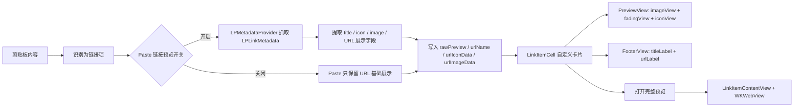

# Paste 链接展示能力逆向技术文档

日期：2026-05-15

执行者：Codex

目标样本：`/Users/evan/Downloads/Paste.app`

样本版本：

- `CFBundleIdentifier`: `com.wiheads.paste`
- `CFBundleShortVersionString`: `6.2.0`
- `CFBundleVersion`: `14547`
- `LSMinimumSystemVersion`: `13.0`
- `LSUIElement`: `true`

## 1. 结论摘要

Paste 面板中的链接不是简单文本卡片，也不是直接使用系统 `LPLinkView` 渲染。它采用的是：

1. 使用系统 `LinkPresentation.framework` 的 `LPMetadataProvider` 拉取网页元数据。
2. 将链接标题、图标、预览图和展示 URL 转成自己的预览模型和缓存字段。
3. 面板卡片使用自定义 AppKit 视图 `PasteCoreUI.LinkItemCell` 渲染，内部拆成 `PreviewView` 和 `FooterView`。
4. 链接完整预览使用 `WKWebView`，并由 `WKNavigationDelegate` 处理加载成功、失败和导航策略。
5. `QuickLook` 只用于文件预览路径，不是链接卡片或链接网页预览的主要方案。

核心判断：Paste 把“联网抓取”和“滚动面板渲染”分离。滚动面板只展示缓存过的轻量数据和图片资源；真正的网页加载只发生在打开链接预览视图时。这是它面板流畅度和隐私提示能够同时成立的关键。

## 2. 调查方法与证据来源

本轮只做只读逆向和项目代码对照，不修改 Paste.app。

| 目的 | 方法 | 证据 |
| --- | --- | --- |
| 确认系统框架 | `otool -L /Users/evan/Downloads/Paste.app/Contents/MacOS/Paste` | 链接了 `LinkPresentation.framework`、`WebKit.framework`、`QuickLook.framework`、`QuickLookUI.framework`、`SwiftUI.framework`、`AppKit.framework` |
| 确认链接元数据抓取 | `nm -m`、`strings`、`otool -tvV` | 存在 `_OBJC_CLASS_$_LPMetadataProvider`、`startFetchingMetadataForURL:completionHandler:`、block signature `v24@?0@"LPLinkMetadata"8@"NSError"16` |
| 确认链接卡片 UI 类 | `strings`、`otool -ov` | `PasteCoreUI.LinkItemCell`、`PreviewView`、`FooterView`、`PasteCoreUI/LinkItemContentView.swift` |
| 确认链接完整预览 | `otool -ov`、`otool -tvV` | `LinkItemContentView` 遵循 `WKNavigationDelegate`，存在 `loadRequest:`、`setNavigationDelegate:`、`didFinishNavigation:`、`didFailNavigation:` |
| 确认缓存字段 | `strings` 主程序和 CoreData `.mom` | `rawPreview`、`urlName`、`urlIconData`、`urlImageData`、`image.platformImage`、`icon.platformImage` |
| 确认 Paste 隐私开关 | `plutil -p .../Localizable.strings` | `settings.privacy.link-preview.title`、`settings.privacy.link-preview.subtitle` |
| 对照我们的项目 | `rg`、`nl -ba` | `ClipboardLinkDetector.swift`、`PanelItemCardPresentation.swift`、`PanelItemCardRenderer.swift`、`PanelPreviewUI.swift`、Rust `link_metadata` schema |

外部系统框架参考：

- Apple Developer Documentation: `LPMetadataProvider`
  <https://developer.apple.com/documentation/linkpresentation/lpmetadataprovider>
- Apple Developer Documentation: `WKWebView`
  <https://developer.apple.com/documentation/webkit/wkwebview>
- Apple Developer Documentation: `WKNavigationDelegate`
  <https://developer.apple.com/documentation/webkit/wknavigationdelegate>
- Apple Developer Documentation: `QLPreviewView`
  <https://developer.apple.com/documentation/quartz/qlpreviewview>

## 3. Paste 的链接展示链路



### 3.1 Paste 链接预览隐私开关

Paste 明确把链接预览作为隐私敏感功能暴露给用户：

- 英文文案：
  - `settings.privacy.link-preview.title = Generate link previews`
  - `settings.privacy.link-preview.subtitle = Download web content for previews; may activate one-time or analytics-sensitive links.`
- 简体中文文案：
  - `settings.privacy.link-preview.title = 生成链接预览`
  - `settings.privacy.link-preview.subtitle = 可能会影响一次性和分析敏感链接。`

二进制中还存在 `_isLinkPreviewsEnabled` 和 `isLinkPreviewsEnabled` 字符串。结合 `LPMetadataProvider` 调用点，可以判断 Paste 的策略是：

- 链接元数据抓取默认受设置开关控制。
- 开启后才会下载网页内容生成预览。
- 关闭时仍可把内容作为链接项展示，但不主动抓取网页预览数据。

这点是 Paste 的产品策略观察。ClipShelf v4 的当前实现没有卡片 metadata 开关：公开 http/https 链接默认生成卡片 metadata，隐私敏感 URL 由 URL policy 拦截为不可自动重试的失败态；用户只保留“网页完整预览”开关，用于控制 `WKWebView` 完整网页加载。

### 3.2 元数据抓取：系统 `LinkPresentation`

反汇编在 `0x10029990c` 附近可见：

- 分配 `LPMetadataProvider`。
- 将 Swift `Foundation.URL` bridge 到 `NSURL`。
- 构造 completion block。
- 调用 `startFetchingMetadataForURL:completionHandler:`。
- completion block signature 为 `LPLinkMetadata` + `NSError`。

相关证据：

- `nm -m` 显示外部符号 `_OBJC_CLASS_$_LPMetadataProvider (from LinkPresentation)`。
- `strings` 显示 `startFetchingMetadataForURL:completionHandler:`。
- `strings` 显示 block 签名 `v24@?0@"LPLinkMetadata"8@"NSError"16`。
- `strings` 显示 `image.platformImage` 和 `icon.platformImage`。

由此判断：

- Paste 抓网页 title、icon、image 的主要入口是系统 `LPMetadataProvider`。
- 它没有直接把 `LPLinkMetadata` 交给系统 `LPLinkView` 渲染，而是把 metadata 拆解为自己的数据字段。
- `image.platformImage` / `icon.platformImage` 说明它会从 `LPLinkMetadata.imageProvider` / `iconProvider` 一类数据转成平台图片，再缓存为自有资源或 Data。

保守置信度：

- 使用 `LPMetadataProvider`：高。
- 把 `LPLinkMetadata` 转成自定义 title/icon/image 字段：高。
- 具体序列化格式和图片压缩参数：中，二进制能确认字段名，但未动态抓取真实数据库样本验证。

### 3.3 缓存模型：避免面板滚动时联网

二进制和 CoreData model 中出现：

- `rawPreview`
- `setRawPreview:`
- `urlName`
- `urlIconData`
- `urlImageData`
- `image.platformImage`
- `icon.platformImage`
- CoreData `.mom` 内有 `ItemEntity`、`rawPreview`、`rawAttributes`、`rawShareRecord`、`metadata`

推断的数据流是：

1. 链接被识别后，先存储基础 item。
2. Paste 会根据链接预览开关决定是否异步使用 `LPMetadataProvider` 下载网页元数据。
3. 元数据完成后生成 `rawPreview` 或等价预览载荷。
4. 标题写入类似 `urlName` 的字段。
5. 图标、预览图写入类似 `urlIconData` / `urlImageData` 的二进制字段。
6. 面板渲染读取缓存字段，不在卡片 cell 内发起网络请求。

这个设计的性能含义：

- 面板卡片复用和滚动时只做本地数据读取、图片解码和布局。
- 网络失败不会阻塞卡片显示，最多降级到 URL / icon fallback。
- 图片资源可以提前缓存，避免大量 cell 同时触发 `LPMetadataProvider`。

## 4. 面板链接卡片 UI 结构

### 4.1 `LinkItemCell` 是自定义 AppKit 视图

`otool -ov` 显示类：

- `_TtC11PasteCoreUI12LinkItemCell`
- 源路径字符串：`PasteCoreUI/LinkItemContentView.swift`
- ivars:
  - `previewView`
  - `footerView`
  - `$__lazy_storage_$_stackView`

内部私有视图：

- `_TtC11PasteCoreUIP33_...PreviewView`
  - `fadingView`
  - `imageView`
  - `iconView`
  - `$__lazy_storage_$_iconViewYAnchorConstraint`
- `_TtC11PasteCoreUIP33_...FooterView`
  - `titleLabel`
  - `urlLabel`
  - `$__lazy_storage_$_stackView`

因此 Paste 的链接卡片可以抽象成：

```text
LinkItemCell
├── stackView
├── PreviewView
│   ├── imageView
│   ├── fadingView
│   └── iconView
└── FooterView
    ├── titleLabel
    └── urlLabel
```

UI 推断：

- 上半部分优先展示网页预览图。
- `fadingView` 用于覆盖渐隐层，增强底部 footer 或 icon 的可读性。
- `iconView` 是站点图标或链接 fallback icon。
- 下半部分 footer 两行展示：标题 + 规范化后的 URL/域名。

关键点：面板卡片没有使用 `WKWebView`。它用的是普通 AppKit 视图和图片/文本控件，这样才能在横向大量条目的场景中保持低成本。

### 4.2 URL 展示规范化策略

反汇编在 `0x100299d88` 附近显示 Paste 对展示 URL 做了自定义处理：

- 调用 `Foundation.URL.host`
- 调用 `Foundation.URL.path`
- 调用 `Foundation.URL.scheme`
- 调用 `Foundation.URL.query`
- 对 host 执行 `"www."` 替换
- 拼接 host / path / query
- 最后使用 `trimmingCharacters(in:)` 去掉首尾字符集

能确认的策略：

- `www.` 会被移除，`www.example.com` 显示为 `example.com`。
- path 会参与展示，所以不是只显示域名。
- query 会被条件性加入展示文本。
- scheme 会被读取并参与判断，说明 Paste 区分 URL 原始 scheme，而不是盲目显示原始字符串。

保守推断的展示规则：

```swift
let host = url.host?.replacingOccurrences(of: "www.", with: "")
var display = host + url.path
if shouldKeepScheme(url.scheme) {
    display = "\(scheme)://\(display)"
}
if shouldShowQuery(url.query) {
    display += "?\(query)"
}
display = display.trimmingCharacters(in: trimmingSet)
```

注意：`shouldKeepScheme` 和 `shouldShowQuery` 的精确高层语义不能仅凭当前二进制完全还原。已确认的是它不是简单 `absoluteString`，而是拆 URL component 后重新组织展示文本。

### 4.3 标题和 URL 的降级

结合字段名和 UI 结构，可以推断降级顺序：

1. 有 `LPLinkMetadata.title` 或等价 `urlName` 时，footer 第一行显示网页标题。
2. 有规范化 URL 时，footer 第二行显示 compact URL。
3. 没有 title 时，卡片仍能展示 URL/domain。
4. 没有 image 时，`PreviewView` 仍能展示 icon/fallback。
5. 没有 icon 时，使用通用链接图标或来源 app 相关 fallback。

## 5. 完整链接预览：`WKWebView`

Paste 的完整链接预览类是：

- `_TtC11PasteCoreUI19LinkItemContentView`
- 源路径字符串：`PasteCoreUI/LinkItemContentView.swift`
- superclass：`NSView`
- protocols：
  - `NSTextViewDelegate`
  - `WKNavigationDelegate`

运行时方法包含：

- `textDidChange:`
- `webView:decidePolicyForNavigationAction:decisionHandler:`
- `webView:didFinishNavigation:`
- `webView:didFailNavigation:withError:`
- `webView:didFailProvisionalNavigation:withError:`

反汇编在 `0x1003237fc` 附近显示完整预览加载策略：

1. 从文本或模型中取 URL 字符串。
2. 用 `Foundation.URL(string:)` 解析。
3. 如果 URL 没有 scheme，拼接 `https://`。
4. 构造 `URLRequest`。
5. timeout 常量约为 `60` 秒。
6. 调用 `WKWebView.loadRequest:`。

可确认的 WebKit 相关 selector：

- `loadRequest:`
- `setNavigationDelegate:`
- `setAllowsLinkPreview:`

结论：

- 面板卡片：自定义轻量视图。
- 打开/预览链接：`WKWebView`。
- 文件预览：`QuickLook` / `QLPreviewView`。

## 6. QuickLook 边界

Paste 链接了 `QuickLook.framework` 和 `QuickLookUI.framework`，但逆向证据显示它主要服务文件预览：

- `FileItemContentView.QuickLookView`
- `QLPreviewItem`
- `QLPreviewView`
- `previewItemURL`
- `previewItemTitle`

链接预览路径的核心类是 `LinkItemContentView`，并且它实现 `WKNavigationDelegate`。所以对于用户的问题“链接预览是不是系统方案”：答案要分层：

- 链接元数据抓取：是系统方案，使用 `LinkPresentation / LPMetadataProvider`。
- 面板链接卡片 UI：不是系统 `LPLinkView`，是 Paste 自定义 AppKit UI。
- 完整网页预览：是系统 WebKit 方案，使用 `WKWebView`。
- QuickLook：主要用于文件，不是链接展示主路径。

## 7. 与 ClipShelf 当前实现的差异

### 7.1 我们已有的能力

当前项目已经有链接数据结构和部分 UI 消费路径：

- `ClipboardLinkDetector.swift`
  - 使用 `NSDataDetector`。
  - 只接受纯链接。
  - 目前要求 `trimmed.contains("://")`。
  - 只接受 `http` / `https`。
  - `displayURL` 当前等于 `canonicalURL`。
- `PanelItemCardPresentation.swift`
  - 有 `linkHost`、`linkDetail`、`linkTitle`。
  - fallback 会去掉 `www.`。
  - title 为空时 footer 显示 compact URL；title 存在时显示 host。
- `PanelItemCardViewState.swift`
  - `PanelCardPreviewState.link(title, host, detail, iconPath, imagePath, accessibilityLabel)` 已具备 UI 入参。
- `PanelItemCardRenderer.swift`
  - 有自定义 `LinkPreviewBlockView`。
  - 支持背景图 `imagePath`。
  - 支持 icon tile `iconPath`。
  - 图片异步加载，使用 view identifier 防止复用串图。
- `PanelPreviewUI.swift`
  - 完整链接预览使用 `WKWebView`。
  - `URLRequest(timeoutInterval: 60)`。
  - `LinkPreviewNavigationDelegate` 限制 main frame / response 只允许 `http` 和 `https`。
- Rust core:
  - 已有 `link_metadata` 表。
  - 字段包括 `canonical_url`、`display_url`、`host`、`title`、`site_name`、`icon_relative_path`、`image_relative_path`、`metadata_state`、retry/fetch timestamps。
  - 旧 v5 schema 曾允许 `pending`、`fetching`、`ready`、`failed`、`disabled`、`stale`；ClipShelf v4 已通过 v7 migration 将运行时状态收敛为 `pending`、`fetching`、`ready`、`failed`、`stale`。当前项目仍在开发阶段，不保留旧 metadata 开关或旧 API 兼容层。

### 7.2 当时识别出的关键缺口与当前状态

逆向初期在 `Sources`、`rust/crates` 和 `Package.swift` 中没有发现：

- `LPMetadataProvider`
- `LPLinkMetadata`
- `LinkPresentation`

因此当时的状态更像是：

- 数据库 schema 已准备好。
- UI 已能消费 title/icon/image。
- 完整预览已经用 WebKit 实现。
- 当时仍缺少一个真正把链接从 `pending` 拉到 `ready` 的系统元数据抓取服务。

ClipShelf v4 已补齐该差异：新增 `LinkMetadataCoordinator`、`LinkPresentationMetadataFetcher`、asset writer、Rust/FFI claim/complete/fail 状态 API，并通过 v7 migration 收敛运行时状态集合。

### 7.3 UI 差异

Paste：

- `PreviewView` 同时有 `imageView`、`fadingView`、`iconView`。
- `FooterView` 固定有 `titleLabel`、`urlLabel`。
- 视觉重点是网页预览图 + 渐隐层 + 站点 icon + 两行 footer。

ClipShelf：

- `LinkPreviewBlockView` 有背景图和 icon tile。
- v4 已改为背景图存在时仍保留 icon tile，并增加轻量渐隐 overlay。
- footer 能显示 title + host/URL，整体层次已补齐为“预览图 + 渐隐层 + 站点 icon + footer”。

UI 优化方向：

- 保留我们自己的原创视觉，不复制 Paste 的具体样式。
- 借鉴它的层级：预览图、轻量渐隐、站点 icon、标题、compact URL。
- 不建议在面板 cell 中嵌入 `WKWebView` 或 `LPLinkView`。

### 7.4 性能差异

Paste 的强点：

- 面板 cell 不联网。
- 面板 cell 不创建 WebView。
- 元数据异步抓取并缓存。
- UI 只消费本地 title/icon/image/url。

当前仍需守住的风险：

- 已有抓取 worker，必须继续保证它只在后台 claim/fetch/complete，不把网络请求移入 cell 渲染路径。
- 如果未来直接在 cell 中临时抓取或加载网页，会破坏滚动性能和隐私预期。
- 图片资源加载已经异步，但需要确保 decode/downsample 不压主线程。

## 8. 架构优化建议与 v4 落地状态

### 8.1 已落地 `LinkMetadataFetching` 服务

v4 已在 Swift 层落地服务，职责只做系统元数据抓取和资源落盘：

```swift
protocol LinkMetadataFetching: Sendable {
    func fetchMetadata(for itemID: String, canonicalURL: URL) async -> LinkMetadataFetchResult
}
```

实现策略：

- 使用 `LPMetadataProvider`。
- ClipShelf v4 中卡片 metadata 默认生成，不受 `webPreviewEnabled` 控制；`webPreviewEnabled` 只控制完整网页 `WKWebView` 预览。
- 每个 URL fetch 使用新的 provider 或可取消 provider 包装，避免 provider 生命周期混乱。
- completion 后提取：
  - `title`
  - `siteName`
  - `iconProvider`
  - `imageProvider`
  - canonical/display URL
- icon/image 转为本地 asset 文件，写入 `icon_relative_path` / `image_relative_path`，不要直接把大图 blob 塞进 SQLite。
- 更新 Rust `link_metadata` 状态为 `ready` / `failed`，或保留在可重试状态；运行时不再写入旧关闭态。

### 8.2 抓取调度与重试

建议利用已有 Rust schema：

- `metadata_state = pending`：待抓取。
- `fetching`：Swift worker 正在处理。
- `ready`：title/icon/image 已落盘。
- `failed`：失败，记录 `failure_code`。
- 旧关闭态已由 v7 migration 清理；运行时状态集合不再包含关闭态。
- `stale`：缓存过期或需要刷新。

调度建议：

- 并发限制 2-3 个，避免复制大量链接时瞬间发起网络风暴。
- 只预取最近 N 条或当前面板可见附近条目。
- 指数退避写入 `next_retry_at_ms`。
- 对 localhost、私有 IP、一次性 token 类 URL 可按隐私策略跳过或延后到用户主动预览。

### 8.3 展示 URL 规范化

建议把 `displayURL` 作为稳定持久化字段，而不是每次 UI 临时拼接。

推荐规则：

1. host 去掉前缀 `www.`。
2. 默认显示 `host + path`。
3. `http` / `https` 可按产品偏好隐藏 scheme；非 http/https 不进入链接类型。
4. query 保留，但长 query 做中间截断或只展示前若干字符。
5. fragment 是否保留要统一；当前 ClipShelf fallback 会保留 fragment，Paste 反汇编只确认读取了 query，未确认 fragment。
6. 始终用左到右文本控制，避免 URL 在中文/RTL 环境中反向或错位。

### 8.4 面板卡片 UI

建议保持自定义 AppKit cell，结构可调整为：

```text
LinkCard
├── previewSurface
│   ├── backgroundImageView: aspectFill, async asset
│   ├── gradientOverlay: only when image exists
│   └── faviconTile: always visible when icon exists, compact height may hide
└── footer
    ├── titleLabel: one line
    └── detailLabel: host/path/query compact display
```

关键约束：

- 面板卡片不能创建 `WKWebView`。
- 面板卡片不能发起网络请求。
- 背景图和 icon 只读本地 asset。
- 图片解码和下采样尽量异步。
- 可见区域内允许预取图片，但必须带取消或 identifier 防串图。

### 8.5 完整预览 WebKit

我们已有的 `PanelPreviewUI.swift` 方向正确，建议继续保持：

- `WKWebView` 只在用户触发预览时创建。
- `URLRequest(timeoutInterval: 60)` 与 Paste 观察结果一致。
- `WKNavigationDelegate` 继续限制 `http` / `https`。
- 关闭预览时清理 `WKWebView`、delegate 和本地 monitor。
- 可考虑独立 `WKProcessPool` 和配置策略，便于未来实现隐私模式或 cookie 隔离。

## 9. 架构师方案草案

架构目标：

- UI 效果：面板链接卡片达到“标题、域名、图标、预览图”四要素完整展示，缺失时优雅降级。
- 性能：滚动面板零网络、零 WebView、图片异步解码。
- 隐私：卡片 metadata 默认生成，但 localhost、私有地址、`.local` 和敏感 query 由 URL policy 阻止自动抓取；完整网页预览可由 `webPreviewEnabled` 关闭。
- 稳定性：抓取失败、图片缺失、重复 URL、长 URL 都不影响卡片可用。

推荐分层：

| 层 | 职责 |
| --- | --- |
| Capture | 识别纯链接，写入 `link_metadata` 基础行 |
| Metadata Worker | 查询 `pending/stale` 链接，调用 `LPMetadataProvider`，落盘 title/icon/image |
| Storage | 保存状态、重试时间、本地 asset 相对路径 |
| Presentation | 生成 title、host、displayURL、icon/image path |
| Panel UI | 自定义 AppKit 卡片，只渲染本地缓存 |
| Preview UI | 用户触发后创建 `WKWebView` 加载页面 |

阶段门执行结果：

1. 已实现链接元数据抓取服务和状态机闭环。
2. 已优化卡片 UI 层次和渐隐/图标显示。
3. 已完成性能、隐私和真实链接 QA 验收。

## 10. QA 和资深 macOS 开发评审清单

### 10.1 QA 验收重点

- 普通公开网页默认能显示 title、host、icon 或 image。
- 关闭“网页完整预览”后，按空格不创建 `WKWebView`，但卡片 metadata 默认生成。
- 抓取失败时仍显示 compact URL，不出现空白卡片。
- 一次性 token 链接、带敏感 query 链接、登录态链接需要确认会被 URL policy 阻止自动 metadata 抓取，或稳定降级。
- 复制 `example.com`、`www.example.com/path`、`https://example.com/path?x=1` 的展示一致且可读。
- 面板滚动 1000 条链接时无明显卡顿。
- 图片资产缺失或损坏时不崩溃、不串图。
- 链接完整预览只允许 `http` / `https`，`file:`、`javascript:`、自定义 scheme 不加载。
- 预览关闭后焦点恢复，WebView 释放，不继续播放/加载。

### 10.2 资深 macOS 开发评审重点

- `LPMetadataProvider` 生命周期是否正确，是否支持取消或超时保护。
- `NSItemProvider` 到 `NSImage` / Data 的转换是否在合适线程完成。
- 图片写盘是否做尺寸和格式控制，避免超大图拖慢面板。
- Swift actor / MainActor 边界是否清晰，UI 更新只在主线程。
- Rust FFI 更新 link metadata 是否幂等，状态转换是否避免 ready 被 pending 覆盖。
- `WKNavigationDelegate` 是否覆盖 action 和 response 两级策略。
- `WKWebView` 是否只在预览 popover 中实例化，cell 内没有 WebKit。
- 多屏、Retina、Dark/Light appearance 下图片和文字是否清晰。

### 10.3 评审结论门槛

只有同时满足以下条件，才建议进入代码修改：

- 架构师方案明确 `LPMetadataProvider` 抓取服务、状态机、URL policy 隐私边界，以及完整网页预览开关。
- QA 认可链接隐私、失败降级和性能验收用例。
- 资深 macOS 开发认可 WebKit/LinkPresentation 生命周期和线程模型。
- UI 方案确认只借鉴技术策略，不复制 Paste 的品牌、文案、尺寸和可识别视觉组合。

## 11. 已知未知与置信度

| 结论 | 置信度 | 说明 |
| --- | --- | --- |
| Paste 使用 `LPMetadataProvider` 抓链接元数据 | 高 | 符号、selector、block signature 和反汇编调用点一致 |
| Paste 链接卡片是自定义 AppKit UI，不是 `LPLinkView` | 高 | `LinkItemCell` / `PreviewView` / `FooterView` 结构明确 |
| Paste 完整链接预览使用 `WKWebView` | 高 | `LinkItemContentView` 遵循 `WKNavigationDelegate`，有 `loadRequest:` |
| QuickLook 主要用于文件预览，不是链接主路径 | 高 | QuickLook 类名集中在 `FileItemContentView` |
| Paste 把 title/icon/image 缓存到自有字段 | 中高 | 字段名和 CoreData model 明确，但未动态读取真实数据库样本 |
| Paste 的链接捕获算法是否接受无 scheme 域名 | 中 | 完整预览路径会给无 scheme URL 补 `https://`，但捕获入口未完全还原 |
| URL query 的精确省略/保留规则 | 中 | 反汇编确认读取 query 并条件拼接，具体高层语义未完全恢复 |

## 12. 执行结果

本轮后续流程已经完成：

1. 架构师基于本文件补充了 `LinkMetadataFetching` 设计方案。
2. QA 和资深 macOS 开发完成评审并推动修订到 v4。
3. v4 实现已落地 Rust/FFI 状态 API、Swift metadata worker、asset writer 和卡片 UI 增强。
4. QA 已按链接隐私、UI 降级、滚动性能和 WebKit 安全策略完成验收。
